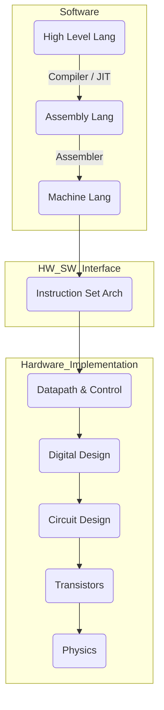
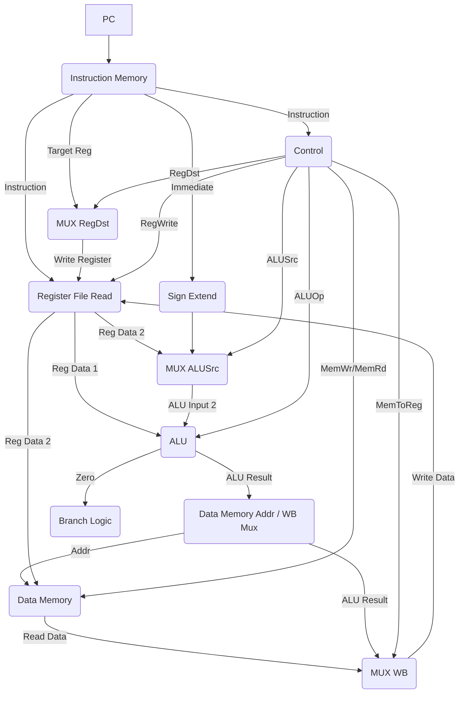
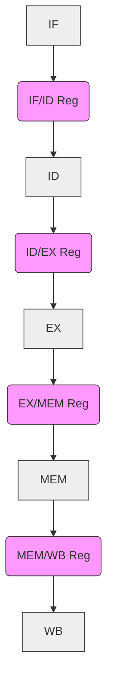
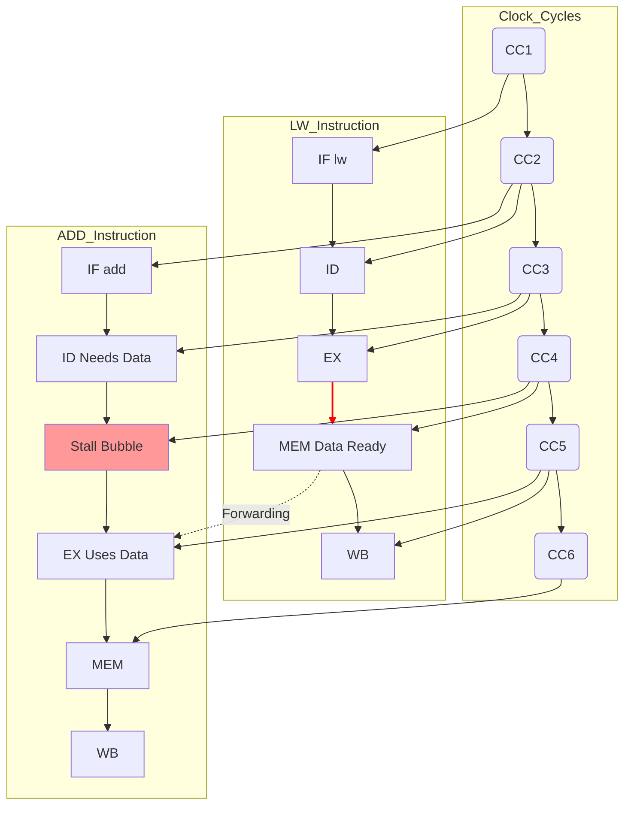

```table-of-contents
```
## 1. 🚀 הקדמה

### 1.1 מודל פון נוימן ורמות הפשטה

###### מבנה המחשב הקלאסי
מבוסס על מודל פון נוימן ומורכב מ-5 רכיבים עיקריים המחוברים באפיקים (Buses):
1.  **מעבד (Processor)**: מבצע את הפקודות (Control Unit + Datapath).
2.  **זיכרון (Memory)**
3.  **קלט (Input)**
4.  **פלט (Output)**

###### רמות הפשטה (Abstraction Levels)
מהחומרה הפיזית ועד לשפת התכנות:



> [!NOTE] ISA Definition
> **ISA (Instruction Set Architecture)**: הממשק הקריטי בין החומרה לתוכנה. מגדיר את הפקודות, הרגיסטרים, מודלי הכתובות ופורמטי הנתונים שהמעבד מבין ומטפל בהם.

### 1.2 ארכיטקטורות: RISC vs CISC

שתי גישות עיקריות לתכנון ה-ISA:
##### CISC (Complex Instruction Set Computer)
*   **מאפיינים**: סט פקודות גדול ומורכב, אורכים משתנים, פעולות מורכבות ישירות על הזיכרון.
*   **דוגמה**: x86.
*   **חסרונות**: חומרה מורכבת, פיענוח קשה, קושי ב-Pipeline.

##### RISC (Reduced Instruction Set Computer)
*   **מאפיינים**: סט פקודות מצומצם, פקודות פשוטות, **אורך קבוע**, ארכיטקטורת **Load/Store**.
*   **דוגמה**: MIPS, ARM.
*   **יתרונות**: חומרה פשוטה ומהירה, פיענוח פשוט, יעיל ל-Pipeline.
*   **חסרונות**: דורש יותר פקודות למשימה, תוכניות ארוכות יותר (IC גבוה).

### 1.3 ייצוג מידע 💾

#### 1.3.1 בסיסי ספירה
*   מעבר בין בסיסים (בינארי, עשרוני, אוקטלי, הקסדצימלי).
*   קיבוץ סיביות למעבר מהיר בינארי $\leftrightarrow$ אוקטלי (3 סיביות) / הקס' (4 סיביות).

#### 1.3.2 ייצוג מספרים שלמים (ב-n סיביות)

##### Unsigned
טווח: $[0, 2^n - 1]$.

##### Signed (שיטת המשלים ל-2 - 2's Complement)
*   **השיטה הנפוצה ביותר.**
*   מספר שלילי = היפוך סיביות (`~num`) + 1.
*   טווח: $[-2^{n-1}, 2^{n-1} - 1]$.
*   חיבור זהה לחיוביים ושליליים. חיסור ($A-B$) = חיבור המשלים ל-2 ($A + (\sim B + 1)$).
*   **הרחבת סימן (Sign Extension)**: שכפול סיבית הסימן (MSB) שמאלה בעת הרחבת מספר הסיביות.

#### 1.3.3 גלישה (Overflow)
*   תוצאת פעולה אריתמטית חורגת מהטווח הניתן לייצוג.
*   **זיהוי בחיבור משלים ל-2**: $Overflow = C_{in\_to\_MSB} \oplus C_{out\_of\_MSB}$.
*   פקודות `addu`/`subu` מתעלמות מגלישה, `add`/`sub` גורמות ל-Exception.

### 1.4 הערכת ביצועי מעבד ⏱️

##### זמן CPU
$CPU \, Time = IC \times CPI \times CCT$
*   IC: מספר פקודות.
*   CPI: מחזורי שעון ממוצע לפקודה. (מחושב כ- $\sum (CPI_i \times IC_i) / IC_{total}$)
*   CCT: זמן מחזור שעון ($1 / \text{Clock Rate}$).

##### חוק אמדל (Amdahl's Law)
ההאצה מוגבלת ע"י החלק שלא שופר.
$\text{Speedup}_{\text{overall}} = \frac{1}{(1 - F_{enh}) + \frac{F_{enh}}{S_{enh}}}$

> [!TIP] Make the Common Case Fast
> חוק אמדל מדגיש את החשיבות של שיפור הרכיבים שתופסים את רוב זמן הריצה.

## 2. 0️⃣1️⃣ אלגברה בוליאנית

### 2.1 יסודות
*   ערכים: 0, 1.
*   פעולות: AND ($\cdot$), OR ($+$), NOT ($\overline{X}$).
*   טבלאות אמת.

### 2.2 חוקים וזהויות (מבחר)
*   זהות, אידמפוטנציה, שלילה, היפוך (כולל כפול), קומוטטיביות, אסוציאטיביות, דיסטריבוטיביות (כולל $X + YZ = (X+Y)(X+Z)$), דה-מורגן, קליטה.

### 2.3 צורות קנוניות

###### SOP (Sum Of Products)
סכום (OR) של מינטרמים ($m_i$). הפונקציה היא $\sum m_i$ לכל $i$ עבורו $F(i)=1$.

###### POS (Product Of Sums)
מכפלה (AND) של מקסטרמים ($M_i$). הפונקציה היא $\prod M_j$ לכל $j$ עבורו $F(j)=0$.

### 2.4 פישוט פונקציות
מציאת ביטוי מינימלי באמצעות חוקים אלגבריים או מפות קרנו.

### 2.5 שערים לוגיים ומערכות אוניברסליות
*   **שער לוגי**: מימוש פיזי של פעולה בוליאנית.
*   **מערכת אוניברסלית**: קבוצת שערים (כמו {NAND} או {NOR}) שבאמצעותה ניתן לממש כל פונקציה (AND, OR, NOT).
    *   מימוש NOT מ-NAND: `NAND(A, A)`
    *   מימוש NOT מ-NOR: `NOR(A, A)`

## 3. 💻 שפת אסמבלי MIPS

### 3.1 עקרונות תכנון (ראו 1.2 ו-5)
RISC, Load/Store, 32 רגיסטרים, אורך פקודה קבוע (32 ביט), 3 פורמטים.

### 3.2 פורמטי פקודות MIPS

##### R-Type (Register)
`op(0) | rs | rt | rd | shamt | funct` - לפעולות רגיסטר-רגיסטר.

##### I-Type (Immediate)
`op | rs | rt | immediate(16)` - לפעולות עם מיידי, גישה לזיכרון, Branches.

##### J-Type (Jump)
`op | target address(26)` - לקפיצות לא מותנות.

### 3.3 פקודות עיקריות (ראו סיכום בסוף פרק 7)
אריתמטיות, לוגיות, גישה לזיכרון, השוואה, הזזות, בקרת זרימה, כפל/חילוק.

### 3.4 מוסכמות שימוש ברגיסטרים
*   **Callee-saved (שמורים ע"י הנקרא)**: `$s0-$s7`, `$gp`, `$sp`, `$fp`, `$ra`. הפונקציה הנקראת אחראית לשמור ולשחזר אותם אם היא משתמשת בהם.
*   **Caller-saved (שמורים ע"י הקורא)**: `$t0-$t9`, `$a0-$a3`, `$v0-$v1`. הפונקציה הקוראת אחראית לשמור אותם (אם היא צריכה את ערכם לאחר הקריאה) לפני הקריאה לפונקציה אחרת.

### 3.5 גישה לזיכרון וכתובות
*   Byte Addressing, Word Access (כפולות של 4).
*   **Alignment חובה!** גישה לא מיושרת = Exception.
*   כתובת ב-`lw`/`sw`: `Base (rs) + SignExtended(Offset)`.
*   Endianness: MARS הוא Little Endian.

## 4. 💡 לוגיקה צירופית וסדרתית, בניית ALU ומקבץ האוגריפ

### 4.1 רכיבים קומבינטוריים

##### Adder (מחבר)
HA, FA, Ripple Carry Adder.

##### ALU (Arithmetic Logic Unit)
מבצע פעולות אריתמטיות ולוגיות, מוציא דגלי סטטוס (Zero, CarryOut, Overflow, Negative).

##### MUX (Multiplexer)
בורר אחת מ-$2^n$ כניסות לפי $n$ קווי בקרה.

##### Decoder (מפענח)
מפעיל אחת מ-$2^n$ יציאות לפי קוד $n$ סיביות.
#### 4.1.1 בניית ה- ALU

### 4.2 רכיבים סדרתיים

##### Flip-Flop (FF)
זיכרון סיבית אחת, משנה מצב לפי שעון (Edge-triggered).

##### Register (רגיסטר)
אוסף FF לאחסון מילה, מסונכרן שעון.

##### Register File (קובץ רגיסטרים)
אוסף רגיסטרים עם יכולת קריאה מ-2 וכתיבה ל-1 בו-זמנית.

#### 4.2.1 בניית מקבץ האוגרים

## 5. 🚶 מעבד Single Cycle

*   כל פקודה במחזור שעון אחד.
*   **חסרון**: מחזור שעון ארוך, נקבע ע"י הפקודה האיטית ביותר (לרוב `lw`).
*   מבנה: חיבור ישיר של רכיבים (PC, זיכרון פקודות, קובץ רגיסטרים, ALU, זיכרון נתונים) עם MUXים ובקרה מרכזית.
### 5.1 תיאור מילולי של נתיב הנתונים
###### 1. Fetch
ה-PC שולח כתובת לזיכרון הפקודות (IM). הפקודה נקראת. ה-PC מעודכן ל-PC+4 (בחישוב נפרד).
###### 2.  Decode
הפקודה מפורקת. מספרי רגיסטרי המקור (rs, rt) נשלחים לקובץ הרגיסטרים (RF) כדי לקרוא את תוכנם. ה-Immediate (אם קיים) עובר Sign Extend. יחידת הבקרה מקבלת את ה-Opcode ומייצרת אותות בקרה.
###### 3.  Execute
ה-ALU מקבל את האופרנדים (מקריאה 1 ב-RF, ומ-MUX הבוחר בין קריאה 2 ב-RF לבין ה-Immediate המורחב) ומבצע את הפעולה שנקבעה ע"י הבקרה. תוצאת ה-ALU משמשת לחישוב כתובת זיכרון (ב-lw/sw), תוצאה אריתמטית/לוגית, או יעד Branch (בחישוב נפרד). דגל ה-Zero מה-ALU נבדק עבור Branches.
###### 4.  Memory
אם הפקודה היא lw/sw, תוצאת ה-ALU (הכתובת) נשלחת לזיכרון הנתונים (DM). עבור `lw`, הנתון הנקרא נשלח לשלב הבא. עבור `sw`, הנתון מקריאה 2 ב-RF נכתב ל-DM.
###### 5.  Write Back
ה- MUX בוחר את הנתון שייכתב חזרה ל-RF: או תוצאת ה-ALU (מפקודות R-type או lw עם immediate) או הנתון שנקרא מה-DM (בפקודת lw). MUX נוסף בוחר את רגיסטר היעד (rd מפקודות R-type, או rt מפקודות lw) לפי אות הבקרה RegDst. אות הבקרה RegWrite מאפשר את הכתיבה.

## 6. 🏃‍♂️ מעבד Multi-cycle

*   כל פקודה מחולקת למספר שלבים (IF, ID, EX, MEM, WB).
*   כל שלב = מחזור שעון אחד.
*   פקודות שונות לוקחות מספר שונה של מחזורים.
*   **יתרון**: מחזור שעון קצר יותר (נקבע ע"י השלב האיטי ביותר).
*   **חסרון**: CPI > 1, בקרה מורכבת (מכונת מצבים).


## 7. 🪈 שיפור ביצועים באמצעות הצנרה (Pipeline)

*   חפיפה בביצוע הפקודות: פקודה חדשה מתחילה בכל מחזור שעון (אידיאלית).
*   **מבנה**: שלבים (IF, ID, EX, MEM, WB) מופרדים ע"י **רגיסטרי Pipeline** (IF/ID, ID/EX, EX/MEM, MEM/WB).
*   **יתרון**: Throughput גבוה (CPI אידיאלי קרוב ל-1).
*   **חסרון**: Hazards.


*(שלבי ה-Pipeline עם רגיסטרי ביניים)*
## 8. סיכונים, פסיקות, וחריגות ב- Pipeline
### 8.1 ⚠️ סיכוני נתונים (Data Hazards) ב-Pipeline

##### הבעיה (RAW - Read After Write)
פקודה צריכה תוצאה שפקודה קודמת טרם כתבה לרגיסטר.

##### פתרון 1: Stalling (Bubbles)
הכנסת NOPs לעיכוב הפקודה התלויה. פשוט, פוגע בביצועים.

##### פתרון 2: Forwarding (Bypassing)
העברת התוצאה ישירות משלב EX או MEM לכניסת ה-ALU בשלב EX של הפקודה התלויה. פותר את רוב המקרים. יחידת Forwarding מזהה תלויות ומכוונת MUXים.

##### פתרון 3: Stall + Forwarding (עבור Load-Use)
תלות בפקודת `lw` דורשת **Stall אחד** בנוסף ל-Forwarding משלב MEM. יחידת Hazard Detection מזהה ומכניסה Bubble.


*(תרשים פשוט של Load-Use Hazard ופתרונו)*

##### פתרון 4: Instruction Reordering (Compiler)
המהדר משנה סדר פקודות כדי להרחיק תלויות.

### 8.2 🚦 סיכוני בקרה (Control Hazards) ופסיקות
#### 8.2.1 סיכוני בקרה (Branch Hazards)

##### הבעיה
תוצאת ה-Branch ידועה רק בשלב מאוחר, פקודות שגויות עלולות להיכנס ל-Pipeline ויש לבטלן (**Flush**).

##### פתרון 1: Stall
הקפאת ה-Pipeline עד לחישוב תוצאת ה-Branch. יקר (מספר מחזורי Stall).

##### פתרון 2: Predict Not Taken
ממשיכים רגיל, אם ה-Branch נלקח - מבצעים Flush. פשוט, יעיל אם רוב ה-Branches לא נלקחים.

##### פתרון 3: Branch Delay Slot
הפקודה שאחרי ה-Branch מתבצעת **תמיד**. המהדר מנסה למלא בפיקוד שימושית (שאינה תלויה בתוצאת ה-Branch) או NOP. מפחית את ה-Penalty.

##### פתרון 4: Dynamic Branch Prediction
החומרה מנבאת לפי היסטוריה.
*   **BHT (Branch History Table)**: שומר ניבוי (1-bit או 2-bit).
*   **2-Bit Predictor**: משפר ניבוי בלולאות (דורש 2 טעויות רצופות לשינוי ניבוי קיצוני).
*   **BTB (Branch Target Buffer)**: שומר גם כתובת יעד משוערת לגישה מהירה יותר בשלב IF.
*   אם הניבוי שגוי -> Flush.

#### 8.2.2 פסיקות וחריגות (Interrupts and Exceptions)

##### הגדרה
אירועים המשנים זרימת בקרה (פנימי=Exception, חיצוני=Interrupt).

##### טיפול
1.  זיהוי האירוע.
2.  שמירת כתובת חזרה (`EPC`) וסיבה (`Cause` ב-Coprocessor 0).
3.  קפיצה ל-Interrupt Handler (קוד של מערכת ההפעלה בכתובת קבועה).
4.  ה-Handler שומר מצב, מטפל, משחזר מצב וחוזר (`eret` או `jr $epc`).
5.  ב-Pipeline: טיפול בפסיקה הראשונה לפי סדר התוכנית, Flush לפקודות שאחריה ב-Pipeline.

> [!WARNING] Precise Exceptions
> חשוב שה-Pipeline יוכל לזהות איזו פקודה גרמה לחריגה ולשמור מצב מדויק כאילו כל הפקודות שלפניה הושלמו ואף אחת מאלה שאחריה לא התחילה.

## 9. 🔢 ייצוג נקודה צפה

*   ייצוג מספרים ממשיים: $\pm \text{Mantissa} \times 2^{\text{Exponent}}$.
*   **תקן IEEE 754**:
    *   Single (32 bit): 1 סימן, 8 אקספוננט (Bias 127), 23 מנטיסה (עם 1 מובלע).
    *   Double (64 bit): 1 סימן, 11 אקספוננט (Bias 1023), 52 מנטיסה.
*   ערכים מיוחדים: $\pm 0$, $\pm \infty$, NaN (Not a Number).
*   דורש חומרה ייעודית (FPU / Coprocessor 1 ב-MIPS) ורגיסטרים ייעודיים (`$f0-$f31`).

## 10. 💾 היררכיית זיכרון (Cache ו-Virtual Memory)

> [!IMPORTANT] Memory Hierarchy Goal
> לגשר על פער המהירויות בין המעבד המהיר לזיכרון הראשי האיטי, תוך יצירת אשליה של זיכרון גדול ומהיר, על בסיס עקרון המקומיות.

### 10.1 זיכרון מטמון (Cache)

##### רעיון
זיכרון SRAM קטן ומהיר קרוב למעבד, מנצל את **עקרון המקומיות** (בזמן ובמרחב).

##### מושגים
*   **Hit**: הנתון ב-Cache.
*   **Miss**: הנתון לא ב-Cache -> הבאה מרמה נמוכה יותר (**Miss Penalty**).
*   **Block/Line**: יחידת העברה (מספר מילים).
*   **Hit/Miss Rate**: אחוז הפגיעות/החטאות.
*   **AMAT (Average Memory Access Time)**: $Hit Time + Miss Rate \times Miss Penalty$.

##### מבני Cache (מיפוי)
1.  **Direct Mapped**: בלוק $\rightarrow$ שורה ספציפית (לפי Index). פשוט, סיכון ל-**Conflict Misses**.
2.  **Fully Associative**: בלוק $\rightarrow$ כל שורה. אין Conflict Misses, יקר (דורש השוואה מקבילית של כל ה-Tags).
3.  **N-Way Set Associative**: בלוק $\rightarrow$ קבוצה ספציפית (לפי Index), ובתוכה ל-N מיקומים (Ways). פשרה נפוצה, מפחית Conflict Misses.

##### מדיניות כתיבה
*   **Write-Through**: כותב ל-Cache ולזיכרון בו-זמנית (אפשר עם **Write Buffer** לייעול).
*   **Write-Back**: כותב רק ל-Cache. כותב לזיכרון רק בעת החלפת בלוק "מלוכלך" (**Dirty Bit**=1). יעיל יותר בכתיבות.

##### מדיניות החלפה (ב-Associative)
*   **LRU (Least Recently Used)**: זורקים את השורה שהשימוש האחרון בה היה הכי מזמן.
*   **Random**: בחירה אקראית.

##### שיפור ביצועים
*   **הקטנת Miss Rate**: בלוק גדול יותר (עד גבול מסוים), Cache גדול יותר, אסוציאטיביות גבוהה יותר, **Prefetching** (הבאה מראש).
*   **הקטנת Miss Penalty**: Cache רב-שכבתי (L1/L2/L3), **Critical Word First** / Early Restart (קבלת המילה המבוקשת ראשונה).
*   **הקטנת Hit Time**: Cache פשוט יותר, גישה מקבילית (Banked/Pipelined).

### 10.2 זיכרון וירטואלי (Virtual Memory - VM)

##### רעיון
שימוש בדיסק כהרחבה ל-RAM, יצירת מרחב כתובות וירטואלי גדול ומוגן לכל תוכנית.

##### מטרות
אשליית זיכרון גדול (יותר מה-RAM הפיזי), הגנה בין תהליכים, יעילות (טעינת רק החלקים הפעילים).

##### מנגנון
*   חלוקה ל**דפים (Pages)** בגודל קבוע (למשל 4KB).
*   **טבלת דפים (Page Table)**: ממפה דפים וירטואליים (VPN) למסגרות פיזיות (PFN - Physical Frame Number). לכל תהליך טבלה משלו. מכילה: **Valid Bit**, PFN, Dirty Bit, הרשאות.
*   **תרגום כתובות**: `VA = VPN | Offset` $\rightarrow$ חיפוש VPN בטבלה $\rightarrow$ אם Valid=1: `PA = PFN | Offset`.
*   **Page Fault**: אם Valid Bit = 0 (הדף בדיסק). גורם ל-Exception. מערכת ההפעלה טוענת את הדף מהדיסק ל-RAM (ומפנה דף אחר אם צריך, כותבת לדיסק אם Dirty=1).

##### האצת תרגום: TLB (Translation Lookaside Buffer)
*   **Cache** מהיר לתרגומי כתובות (VPN $\rightarrow$ PFN) שבוצעו לאחרונה.
*   **TLB Hit**: התרגום מהיר.
*   **TLB Miss**: נדרשת גישה לטבלת הדפים בזיכרון הראשי (איטי), או Page Fault אם הדף לא בזיכרון.

##### שילוב Cache ו-VM
*   **PIPT (Physically Indexed, Physically Tagged)**: הנפוץ ביותר. תרגום VA->PA (דרך TLB) **ואז** גישה ל-Cache עם PA.
*   **VIPT (Virtually Indexed, Physically Tagged)**: גישה ל-Cache (Index מ-VA) ותרגום ב-TLB **במקביל**. השוואת Tag פיזי. מהיר יותר, דורש טיפול ב-Aliases (סינונימים).

> [!NOTE] Aliasing/Synonyms in VIPT Cache
> בעיה שבה שתי כתובות וירטואליות שונות מצביעות לאותה כתובת פיזית. ב-VIPT Cache, אם ה-Index שלהן שונה, הן עלולות להיכנס לשתי שורות Cache שונות למרות שהן מייצגות את אותו נתון פיזי, מה שיוצר חוסר קונסיסטנטיות. הפתרון דורש שהחלק של ה-Index + Offset בכתובת הוירטואלית יהיה קטן או שווה לגודל דף, או מנגנוני בדיקה נוספים.