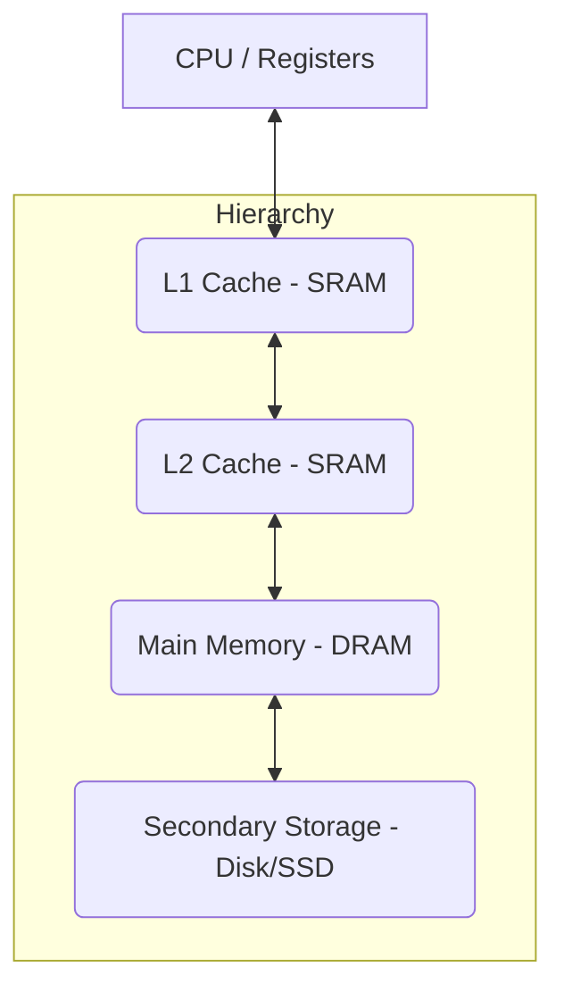

```table-of-contents
```
## 1. 💾 המוטיבציה להיררכיית זיכרון

> [!WARNING] The Memory Wall
> קיים פער הולך וגדל ("חומת הזיכרון") בין מהירות המעבדים (CPU), הגדלה בקצב מהיר (כ-60% בשנה היסטורית, אם כי הואט לאחרונה עקב מגבלות הספק), לבין מהירות הגישה לזיכרון הראשי (DRAM), הגדלה בקצב איטי בהרבה (כ-9% בשנה). פער זה יוצר צוואר בקבוק בביצועי המערכת.

##### עקרון המקומיות (Principle of Locality)
*   **הבסיס לפתרון**: תוכניות נוטות לגשת לחלק קטן יחסית ממרחב הכתובות שלהן בכל פרק זמן נתון.
    *   **מקומיות בזמן (Temporal Locality)**: אם ניגשו לנתון/פקודה, סביר שיגשו אליו/ה שוב בקרוב (למשל, משתנים בלולאה, קוד בתוך לולאה).
    *   **מקומיות במרחב (Spatial Locality)**: אם ניגשו לכתובת מסוימת, סביר שיגשו בקרוב לכתובות סמוכות (למשל, גישה סדרתית לפקודות, גישה לאיברי מערך).

##### היררכיית הזיכרון
*   **המטרה**: ליצור אשליה של זיכרון שהוא **גדול וזול** (כמו הרמות הנמוכות) וגם **מהיר** (כמו הרמות הגבוהות).
*   **הגישה**: ארגון הזיכרון במספר רמות (Levels):
    *   **רמה 1 (L1)**: קטנה, מהירה מאוד ויקרה (לרוב SRAM, על שבב המעבד) - **Cache L1**.
    *   **רמה 2 (L2)**: גדולה ואיטית יותר מ-L1, אך עדיין מהירה מהזיכרון הראשי (לרוב SRAM, על/קרוב לשבב המעבד) - **Cache L2**.
    *   **(אופציונלי) רמה 3 (L3)**: גדולה ואיטית יותר מ-L2.
    *   **רמה N (זיכרון ראשי - Main Memory)**: גדולה משמעותית, איטית יותר (DRAM).
    *   **רמה N+1 (אחסון משני - Secondary Storage)**: גדולה מאוד ואיטית מאוד (דיסק קשיח, SSD).
*   **אופן פעולה**: כל רמה משמשת כ-"מטמון" (Cache) עבור הרמה שמתחתיה. נתונים ופקודות מועתקים לפי הצורך מרמות איטיות וגדולות לרמות מהירות וקטנות יותר, בהתבסס על עקרון המקומיות.


*(היררכיית הזיכרון)*

## 2. ⚡ זיכרון מטמון (Cache Memory)

### 2.1 מושגים בסיסיים
*   **Cache**: זיכרון קטן ומהיר (SRAM) המשמש לשיפור זמן הגישה הממוצע לזיכרון איטי יותר (DRAM).
*   **Block / Line (בלוק / שורה)**: יחידת המידע המינימלית המועברת בין רמות הזיכרון (למשל, בין Cache לזיכרון הראשי). מכילה בדרך כלל מספר מילים (למשל, 4, 8, 16 מילים). גודל בלוק מינימלי הוא מילה אחת.
*   **Hit**: גישה לנתון המבוקש שנמצא כבר ב-Cache.
*   **Miss**: גישה לנתון המבוקש שאינו נמצא ב-Cache.
*   **Hit Time**: הזמן הנדרש לגישת Hit (כולל זמן הבדיקה אם זה Hit או Miss).
*   **Miss Penalty**: הזמן הנוסף הנדרש לטיפול ב-Miss (הבאת הבלוק מהרמה הנמוכה + הכנסתו ל-Cache + העברתו למעבד).
*   **Hit Rate**: אחוז הגישות שהן Hit.
*   **Miss Rate**: אחוז הגישות שהן Miss ($Miss Rate = 1 - Hit Rate$).
*   **AMAT (Average Memory Access Time)**: זמן גישה ממוצע לזיכרון.
    $AMAT = Hit Time + Miss Rate \times Miss Penalty$

### 2.2 סוגי Misses
*   **Compulsory (Cold Start)**: ה-Miss הראשון לבלוק שמעולם לא היה ב-Cache. בלתי נמנע, אך חלקו קטן בתוכניות ארוכות.
*   **Capacity**: ה-Cache קטן מדי להכיל את כל הבלוקים שהתוכנית צריכה בו-זמנית, ובלוקים נזרקים ומוחזרים. הפתרון: הגדלת ה-Cache.
*   **Conflict (Collision)**: מתרחש ב-Direct Mapped או Set Associative. מספר בלוקים מהזיכרון הראשי מתמפים לאותה שורה/קבוצה ב-Cache ומתחרים עליה, גם אם יש מקום פנוי במקומות אחרים. הפתרון: הגדלת האסוציאטיביות.
*   **(Coherence - לא נדון לעומק)**: נובע משינויים בזיכרון ע"י גורמים אחרים (I/O, מעבדים אחרים במערכת מרובת-ליבות) הדורשים עדכון/פסילה של העותק ב-Cache.

### 2.3 מבני Cache (שיטות מיפוי)

קובעים היכן בלוק מהזיכרון הראשי יכול להיות ממוקם ב-Cache.
#### 2.3.1 חלוקת הכתובת
כתובת הזיכרון הפיזי מחולקת לשדות כדי לקבוע את מיקום הבלוק ב-Cache ולבדוק Hit/Miss:
`| Tag | Index | Block Offset | Byte Offset |`

*   **Byte Offset**: מספר הסיביות הנמוכות הנדרשות לזיהוי בית בתוך מילה (למשל, 2 סיביות לכתובת בית בתוך מילה של 4 בתים). (מתעלמים ממנו אם הגישה היא ברמת מילה).
*   **Block Offset**: מספר הסיביות הנדרשות לזיהוי מילה ספציפית בתוך הבלוק. אם יש $2^m$ מילים בבלוק, נדרשות $m$ סיביות.
*   **Index**: מספר הסיביות הקובעות לאיזו **שורה** (ב-Direct Mapped) או **קבוצה** (ב-Set Associative) הבלוק מתמפה. אם יש $2^n$ שורות/קבוצות, נדרשות $n$ סיביות.
*   **Tag**: שאר הסיביות העליונות של הכתובת. משמשות לזיהוי ייחודי של הבלוק המאוחסן בשורה/קבוצה מסוימת.

#### 2.3.2 מבנה שורת Cache
כל שורה ב-Cache מכילה:
*   **Valid Bit (V)**: האם השורה מכילה נתונים תקפים (1) או שהיא ריקה/לא תקפה (0).
*   **Tag**: ה-Tag של הבלוק המאוחסן כעת בשורה זו.
*   **Data**: הנתונים של הבלוק עצמו.
*   **(אופציונלי, ל-Write-Back)**: **Dirty Bit (D)**.

#### 2.3.3 Direct Mapped (מיפוי ישיר)
*   כל בלוק מהזיכרון הראשי יכול להיות ממוקם רק ב**שורה אחת ספציפית** ב-Cache.
*   **חישוב שורה**: `Cache Index = (Block Address) modulo (Number of Blocks in Cache)` (זה שקול ללקיחת $n$ סיביות ה-Index מהכתובת).
*   **בדיקת Hit**:
    1.  השתמש ב-Index מהכתובת כדי לגשת לשורה המתאימה.
    2.  בדוק אם `Valid Bit == 1`.
    3.  אם כן, השווה את ה-Tag מהכתובת עם ה-Tag המאוחסן בשורה.
    4.  אם גם ה-Tags שווים -> **Hit**. אחרת -> **Miss**.
*   **יתרונות**: פשוט וזול למימוש, Hit Time מהיר.
*   **חסרונות**: סיכון גבוה ל-Conflict Misses.

#### 2.3.4 Fully Associative (אסוציאטיבי מלא)
*   כל בלוק מהזיכרון הראשי יכול להיות ממוקם **בכל שורה** ב-Cache.
*   **אין Index**. הכתובת מחולקת ל-`| Tag | Block Offset | Byte Offset |`.
*   **בדיקת Hit**: יש להשוות את ה-Tag מהכתובת עם ה-Tags **בכל השורות** ב-Cache **במקביל**.
*   **יתרונות**: מבטל Conflict Misses, פוטנציאל ל-Miss Rate הנמוך ביותר.
*   **חסרונות**: יקר ומורכב למימוש (דורש השוואות מקביליות רבות).

#### 2.3.5 N-Way Set Associative (אסוציאטיבי ל-N קבוצות)
*   **פשרה** בין שתי השיטות הקודמות.
*   ה-Cache מחולק ל**קבוצות (Sets)**. כל בלוק מהזיכרון הראשי יכול להיות ממוקם רק ב**קבוצה אחת ספציפית**, הנקבעת ע"י ה-**Index**.
*   בתוך הקבוצה, הבלוק יכול להיות ממוקם **בכל אחת מ-N השורות (Ways)** הקיימות באותה קבוצה.
    *   Direct Mapped הוא 1-Way Set Associative.
    *   Fully Associative הוא M-Way Set Associative (כאשר M הוא מספר השורות הכולל).
*   **חישוב קבוצה**: `Set Index = (Block Address) modulo (Number of Sets in Cache)`.
*   **בדיקת Hit**:
    1.  השתמש ב-Index מהכתובת כדי לגשת לקבוצה המתאימה.
    2.  השווה את ה-Tag מהכתובת עם ה-Tags **בכל N השורות (Ways)** באותה קבוצה **במקביל**.
    3.  אם נמצא Tag תואם ויש Valid Bit תקין באחד ה-Ways -> **Hit**. אחרת -> **Miss**.
*   **יתרונות**: מפחית Conflict Misses ביחס ל-Direct Mapped, פשוט ויקר פחות מ-Fully Associative. **הנפוץ ביותר במעבדים מודרניים**.

> [!NOTE] Associativity Trade-offs
> הגדלת האסוציאטיביות (עבור גודל Cache נתון) מקטינה את מספר הקבוצות (ואת גודל ה-Index) ומגדילה את גודל ה-Tag. היא מקטינה Conflict Misses אך עלולה להגדיל מעט את ה-Hit Time (בגלל הצורך לבחור בין ה-Ways).

### 2.4 מדיניות כתיבה (Write Policy)

קובעת מתי נתון שנכתב ל-Cache נכתב גם לרמה הבאה בהיררכיה.

##### Write-Through
*   כל כתיבה ל-Cache גוררת **מיד** כתיבה גם לרמה הבאה.
*   **Write Buffer**: משמש כחוצץ לרישום הכתיבות המיועדות לזיכרון, כדי שהמעבד לא יתעכב. המעבד כותב ל-Cache ול-Buffer וממשיך. הבאפר כותב לזיכרון ברקע. אם הבאפר מתמלא, המעבד יתעכב (Stall).

##### Write-Back
*   הכתיבה מתבצעת **רק** ל-Cache.
*   **Dirty Bit**: מסמן אם בלוק ב-Cache שונה מאז שהובא מהזיכרון.
*   הבלוק המעודכן נכתב לרמה הבאה **רק** כאשר הוא **מוחלף** בבלוק אחר **וגם** ה-Dirty Bit שלו דלוק.
*   **יתרונות**: פחות כתיבות לזיכרון, חוסך רוחב פס.
*   **חסרונות**: מורכב יותר, דורש טיפול בקונסיסטנטיות.

### 2.5 מדיניות החלפה (Replacement Policy)

ב-Set Associative או Fully Associative, כאשר מתרחש Miss וכל ה-Ways בקבוצה/ב-Cache תפוסים, יש לבחור איזה בלוק קיים להחליף.

##### LRU (Least Recently Used)
*   מחליפים את הבלוק שלא היה בשימוש במשך הזמן הארוך ביותר. נחשבת ליעילה אך מורכבת למימוש מדויק בחומרה.
*   **Pseudo-LRU**: קירובים פשוטים יותר.

##### Random
*   בוחרים בלוק להחלפה באופן אקראי. פשוט למימוש, ביצועים סבירים.

### 2.6 שיפור ביצועי Cache

#### 2.6.1 הקטנת Miss Rate
*   **Compulsory**: הגדלת גודל הבלוק (מביא יותר מידע רלוונטי ב-Miss, מנצל Spatial Locality), Prefetching.
*   **Capacity**: הגדלת גודל ה-Cache הכולל.
*   **Conflict**: הגדלת רמת האסוציאטיביות.

#### 2.6.2 הקטנת Miss Penalty
*   **Cache מרובה רמות (L1, L2, L3)**: L1 קטן ומהיר (מזעור Hit Time), L2 גדול יותר (מזעור Miss Rate החוצה ל-RAM).
*   **Critical Word First / Early Restart**: קבלת המילה המבוקש ראשונה מהבלוק המובא, ומאפשר למעבד להמשיך במקביל להבאת שאר הבלוק.
*   **Prefetching (הבאה מראש)**: הבאת נתונים/פקודות ל-Cache *לפני* שהמעבד מבקש אותם, על סמך ניבוי (חומרתי או תוכנתי).

#### 2.6.3 הקטנת Hit Time
*   Cache קטן ופשוט יותר (פחות אסוציאטיבי).
*   **גישה מקבילית**:
    *   **Banked Caches**: חלוקת ה-Cache לבנקים נפרדים לאפשר גישות מקבילות.
    *   **Pipelined Cache Access**: חלוקת הגישה ל-Cache למספר שלבי Pipeline.
*   **הפרדת I-Cache ו-D-Cache**: מאפשר הבאת פקודה וגישה לנתון במקביל.

### 2.7 מדידת ביצועים

*   **AMAT**: $Hit Time + Miss Rate \times Miss Penalty$.
*   **זמן CPU כולל**: $CPU \, Time = IC \times (CPI_{Base} + \frac{\text{Memory Stall Cycles}}{\text{Instruction}}) \times CCT$
    *   $\text{Memory Stall Cycles} = \frac{\text{Memory Accesses}}{\text{Program}} \times Miss Rate \times Miss Penalty$
    *   $\frac{\text{Memory Stall Cycles}}{\text{Instruction}} = \frac{\text{Memory Accesses}}{\text{Instruction}} \times Miss Rate \times Miss Penalty$ (כאשר Penalty במחזורי שעון)
    *   ניתן לחשב בנפרד עבור I-Cache ו-D-Cache.

> [!IMPORTANT] Cache is Crucial
> התנהגות ה-Cache (בעיקר Miss Rate ו-Miss Penalty) היא קריטית לביצועי המערכת הכוללים, במיוחד במעבדים מהירים. אי אפשר להזניח אותה בהערכת ביצועים.

---

## 3. 💾 זיכרון וירטואלי (Virtual Memory - VM)

### 3.1 רעיון ומטרות
*   **רעיון**: שימוש באחסון משני (דיסק/SSD) כהרחבה לזיכרון הראשי (RAM), ויצירת מרחב כתובות **וירטואלי** גדול, רציף ופרטי לכל תהליך (תוכנית רצה).
*   **מטרות**:
    *   **אשליית זיכרון גדול**: כל תהליך רואה מרחב זיכרון גדול משלו, ללא תלות ב-RAM הפיזי.
    *   **הגנה (Protection)**: הפרדה בין מרחבי הכתובות של תהליכים שונים ובינם לבין מערכת ההפעלה.
    *   **יעילות (Efficiency)**:
        *   טעינת רק החלקים הנחוצים של התוכנית ל-RAM (Demand Paging).
        *   שיתוף קוד/נתונים בין תהליכים (Mapping של דפים וירטואליים שונים לאותו דף פיזי).
        *   Relocation קל של תוכניות בזיכרון.

### 3.2 מנגנון מיפוי דפים

##### דפים ומסגרות
*   מרחב הכתובות הוירטואלי והזיכרון הפיזי מחולקים ליחידות בגודל קבוע: **דפים (Pages)** במרחב הוירטואלי, ו-**מסגרות (Frames)** במרחב הפיזי. (גודל דף = גודל מסגרת, לרוב 4KB).

##### טבלת דפים (Page Table)
*   מבנה נתונים (לרוב בזיכרון הראשי) הממפה בין דפים וירטואליים (VPN) למסגרות פיזיות (PFN).
*   לכל **תהליך** יש טבלת דפים משלו. רגיסטר מיוחד במעבד (`Page Table Base Register`) מצביע על תחילת הטבלה הפעילה.
*   כל **כניסה בטבלה (Page Table Entry - PTE)** מכילה:
    *   **Valid Bit (V)**: האם הדף נמצא בזיכרון הפיזי (1) או בדיסק (0)?
    *   **Physical Frame Number (PFN)**: מספר המסגרת הפיזית (אם Valid=1).
    *   **(אופציונלי)** כתובת הדף בדיסק (אם Valid=0).
    *   **ביטי הרשאות**: Read, Write, Execute.
    *   **Dirty Bit (D)**: האם הדף נכתב מאז שהובא מהדיסק?
    *   **(אופציונלי)** ביטים נוספים (למשל, Reference Bit ל-LRU).

##### תרגום כתובות (Address Translation)
1.  המעבד מייצר **כתובת וירטואלית (VA)**.
2.  ה-VA מחולקת ל-**Virtual Page Number (VPN)** ול-**Page Offset** (ההיסט בתוך הדף).
    *   `VA = VPN | Offset`
    *   מספר סיביות ה-Offset נקבע לפי גודל הדף (למשל, 12 סיביות לדף 4KB).
3.  החומרה (MMU) משתמשת ב-VPN כאינדקס לטבלת הדפים.
4.  **בדיקת Valid Bit**:
    *   **אם Valid=1 (Page Hit)**:
        *   קוראים את ה-PFN מה-PTE.
        *   הכתובת הפיזית (PA) מחושבת: `PA = PFN | Offset`.
        *   ניגשים ל-PA בזיכרון הפיזי (או ב-Cache).
        *   (בודקים גם הרשאות).
    *   **אם Valid=0 (Page Fault)**:
        *   החומרה מייצרת Exception.
        *   מערכת ההפעלה (OS) נכנסת לפעולה (Page Fault Handler):
            1.  מוצאת את הדף החסר בדיסק.
            2.  מוצאת מסגרת פיזית פנויה ב-RAM (או מפנה מסגרת קיימת לפי מדיניות החלפה - לרוב LRU מקורב. אם המסגרת המפונה "מלוכלכת" (Dirty=1), כותבת אותה קודם לדיסק).
            3.  טוענת את הדף המבוקש מהדיסק למסגרת הפיזית.
            4.  מעדכנת את ה-PTE בטבלת הדפים (Valid=1, PFN חדש, Dirty=0).
            5.  חוזרת לתוכנית, המנסה שוב את אותה גישה לזיכרון (והפעם יהיה Page Hit).

> [!WARNING] Page Fault Penalty
> Page Fault הוא אירוע יקר מאוד מבחינת זמן (דורש גישה לדיסק האיטי). לכן, חיוני למזער את שיעור ה-Page Faults.

### 3.3 האצת תרגום: TLB (Translation Lookaside Buffer)

##### הבעיה
גישה לטבלת הדפים (שבזיכרון הראשי) עבור *כל* גישה לזיכרון היא איטית מאוד (מכפילה למעשה את זמן הגישה לזיכרון).

##### הפתרון: TLB
*   **Cache מהיר** (לרוב Fully Associative או Set Associative, קטן יחסית) השומר את **התרגומים האחרונים** שבוצעו (VPN $\rightarrow$ PFN + ביטי סטטוס והרשאות).
*   נמצא בתוך ה-MMU.

##### תהליך הגישה עם TLB
1.  עם קבלת VA, ה-MMU מחפש את ה-**VPN** ב-**TLB במקביל** לחישוב ה-Index ל-Cache (ב-VIPT) או לפני הגישה ל-Cache (ב-PIPT).
2.  **אם TLB Hit**:
    *   ה-PFN וביטי ההרשאות נלקחים **ישירות מה-TLB** (מהיר).
    *   ה-PA מחושב.
    *   (בודקים הרשאות).
    *   ניגשים ל-Cache/זיכרון עם ה-PA.
3.  **אם TLB Miss**:
    *   החומרה (או ה-OS) ניגשת ל**טבלת הדפים** בזיכרון הראשי כדי למצוא את ה-PTE המתאים.
    *   **אם PTE.Valid=1 (הדף בזיכרון)**:
        *   התרגום (PFN, הרשאות וכו') נטען ל-TLB (תוך החלפת כניסה קיימת אם צריך, למשל ב-LRU או Random).
        *   הגישה ממשיכה כמו ב-TLB Hit.
    *   **אם PTE.Valid=0 (הדף בדיסק)**:
        *   מתרחש **Page Fault** (כמו שתואר קודם). לאחר שה-OS טוען את הדף ומעדכן את ה-PTE, חוזרים על הפקודה, מה שיגרום עכשיו ל-TLB Miss ואז לטעינת הכניסה החדשה ל-TLB.

> [!NOTE] TLB Performance
> ה-TLB מנצל את המקומיות (בזמן ובמרחב) של הגישה לדפים כדי להאיץ באופן דרמטי את רובם המכריע של תרגומי הכתובות (TLB Hit Rate גבוה מאוד).

### 3.4 שילוב Cache ו-VM

##### סוגי Cache ביחס לתרגום כתובות
*   **PIPT (Physically Indexed, Physically Tagged)**: ה-Cache משתמש **רק** בכתובות פיזיות (לאחר תרגום). פשוט ואמין, אך התרגום (TLB/Page Table) חייב להסתיים לפני הגישה ל-Cache.
*   **VIPT (Virtually Indexed, Physically Tagged)**: ה-Index ל-Cache נלקח מה-VA, הגישה ל-Cache והתרגום ב-TLB מתבצעים **במקביל**. ה-Tag המאוחסן והנבדק הוא פיזי. מהיר יותר, אך דורש טיפול ב-**Aliases/Synonyms** (שתי VA שונות הממופות לאותו PA).
*   **(VIVT)**: אינדקס ותג וירטואליים. מהיר ביותר, אך בעיות קשות עם Aliases ודורש Flush של ה-Cache בהחלפת קונטקסט.

> [!TIP] VIPT Implementation
> כדי להימנע מבעיית ה-Aliases ב-VIPT, לרוב דואגים שגודל ה-Cache חלקי האסוציאטיביות יהיה קטן או שווה לגודל דף, מה שמבטיח שה-Index + Offset נלקחים רק מסיביות ה-Offset של ה-VA, הזהות גם ב-PA.

