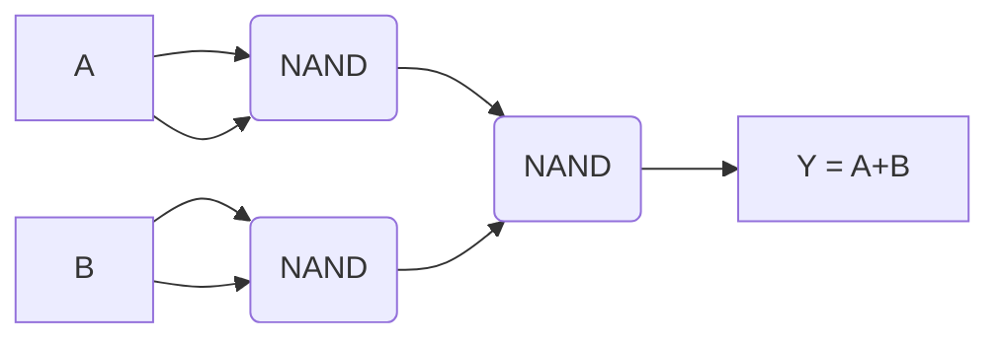

```table-of-contents
```
## 1 📖 יסודות האלגברה הבוליאנית

### 1.1 הגדרה והיסטוריה
אלגברה בוליאנית היא מערכת מתמטית העוסקת בערכים בינאריים (0 ו-1, או False ו-True). היא פותחה על ידי ג'ורג' בול (1854) ופורמלה על ידי א.ו. הנטינגטון (1904). היא מהווה את הבסיס הלוגי למדעי המחשב ולתכנון מעגלים דיגיטליים.

##### משתנה בוליאני
משתנה המקבל אחד משני ערכים בלבד: **0** (False) או **1** (True).

### 1.2 פעולות בסיסיות (אקסיומות)
האלגברה מוגדרת על קבוצת הערכים $\{0, 1\}$ ושלוש פעולות יסוד:

#### 1.2.1 פעולת AND (וגם) 🤝
*   תוצאה 1 רק אם **כל** האופרנדים הם 1.
*   מקביל ל'וגם' לוגי.

| A | B | A ∧ B |
|---|---|---|
| 0 | 0 | 0 |
| 0 | 1 | 0 |
| 1 | 0 | 0 |
| 1 | 1 | 1 |

#### 1.2.2 פעולת OR (או) ➕
*   תוצאה 1 אם **לפחות אחד** מהאופרנדים הוא 1.
*   מקביל ל'או' לוגי.

| A   | B   | A ∨ B |
| --- | --- | ----- |
| 0   | 0   | 0     |
| 0   | 1   | 1     |
| 1   | 0   | 1     |
| 1   | 1   | 1     |

#### 1.2.3 פעולת NOT (שלילה) 🚫
*   הופך את ערך האופרנד (0 ל-1, 1 ל-0).
*   מקביל ל'לא' לוגי.

| A | ¬A |
|---|---|
| 0 | 1 |
| 1 | 0 |

### 1.3 טבלאות אמת 📊
מציגות את תוצאת הפעולות/פונקציות עבור כל צירוף קלט אפשרי:

| X | Y | $X \cdot Y$ (AND) | $X + Y$ (OR) | $\overline{X}$ (NOT) |
| :---: | :---: | :---------------: | :--------------: | :----------------: |
| 0 | 0 | 0                 | 0                | 1                  |
| 0 | 1 | 0                 | 1                | 1                  |
| 1 | 0 | 0                 | 1                | 0                  |
| 1 | 1 | 1                 | 1                | 0                  |

> [!NOTE] Functions
> פונקציה בוליאנית היא פעולה על משתנים בוליאניים המחזירה ערך בוליאני (0 או 1). טבלת אמת מייצגת פונקציה באופן מלא. עבור $n$ משתני קלט, יש $2^n$ שורות בטבלת האמת ו-$2^{2^n}$ פונקציות אפשריות.

## 2 📜 חוקים, משפטים ופישוט

### 2.1 חוקים ומשפטים עיקריים
חוקים אלו משמשים לפישוט וניתוח ביטויים בוליאניים.

| #   | שם החוק/משפט               | צורת AND                                               | צורת OR                                                |
| :-- | :------------------------- | :----------------------------------------------------- | :----------------------------------------------------- |
| א'  | זהות/אדישות                | $X \cdot 1 = X$                                        | $X + 0 = X$                                            |
| ב'  | אידמפוטנציה (Idempotent)   | $X \cdot X = X$                                        | $X + X = X$                                            |
| ג'  | שלילה/השמדה (Annihilation) | $X \cdot 0 = 0$                                        | $X + 1 = 1$                                            |
| ד'  | משלים/היפוך                | $X \cdot \overline{X} = 0$                             | $X + \overline{X} = 1$                                 |
| ה'  | קומוטטיביות                | $X \cdot Y = Y \cdot X$                                | $X + Y = Y + X$                                        |
| ו'  | אסוציאטיביות               | $(X \cdot Y) \cdot Z = X \cdot (Y \cdot Z)$            | $(X + Y) + Z = X + (Y + Z)$                            |
| ז'  | פילוג                      | $X \cdot (Y + Z) = XY + XZ$                            | $X + (Y \cdot Z) = (X + Y) \cdot (X + Z)$              |
| ח'  | היפוך כפול                 | $\overline{(\overline{X})} = X$                        | -                                                      |
| ט'  | דה-מורגן (De Morgan)       | $\overline{(X \cdot Y)} = \overline{X} + \overline{Y}$ | $\overline{(X + Y)} = \overline{X} \cdot \overline{Y}$ |
| י'  | קליטה (Absorption)         | $X \cdot (X+Y) = X$                                    | $X + (X \cdot Y) = X$                                  |
| יא' | היפוך נעלם (Consensus)     | $XY + \overline{X}Z + YZ = XY + \overline{X}Z$         | $(X+Y)(\overline{X}+Z)(Y+Z) = (X+Y)(\overline{X}+Z)$   |
|     | (גרסה שימושית)             | $X \cdot (\overline{X}+Y) = X \cdot Y$                 | $X + (\overline{X} \cdot Y) = X + Y$                   |

> [!IMPORTANT] חוק הפילוג השני
> שימו לב לחוק הפילוג $X + (Y \cdot Z) = (X + Y) \cdot (X + Z)$, הוא **ייחודי** לאלגברה בוליאנית ולא קיים באלגברה רגילה. ניתן להוכיח אותו באמצעות פישוט אלגברי או טבלת אמת.
### 2.2 עקרון הדואליות 🔄
*   **הגדרה**: לכל ביטוי/זהות $E$, קיים ביטוי/זהות דואלי $E^D$ המתקבל ע"י החלפת AND ($\cdot$) $\leftrightarrow$ OR ($+$) ו- $0 \leftrightarrow 1$ (המשתנים נשארים זהים).
*   **כלל**: אם $E_1 = E_2$ נכון, אז גם $E_1^D = E_2^D$ נכון.
*   **דוגמה**: דה-מורגן $(\overline{X \cdot Y} = \overline{X} + \overline{Y})^D \implies \overline{X + Y} = \overline{X} \cdot \overline{Y}$.

> [!WARNING] Duality vs NOT
> הדואליות $E^D$ **אינה** זהה לפעולת ההיפוך (NOT) $\overline{E}$.
### 2.3 פישוט ביטויים (מינימיזציה) ✂️
*   **מטרה**: לפשט פונקציה בוליאנית לביטוי מינימלי (פחות אופרטורים ומשתנים).
*   **חשיבות**: הבנה קלה יותר, מימוש חומרתי זול ויעיל יותר (פחות שערים לוגיים).
*   **שיטות**: פישוט אלגברי (שימוש בחוקים), מפות קרנו, Quine-McCluskey.
*   **דוגמה לפישוט (שקף 38):**
    $F = z \cdot x + z \cdot \overline{x}y$
    $= z(x + \overline{x}y)$ (לפי חוק הפילוג ז')
    $= z(x+y)$ (לפי חוק היפוך נעלם יא' - גרסה שימושית)

#### 2.3.1 מפת קרנו
צורה גיאומטרית המורכבת ממלבנים, אשר מאפשר לצמצם ביטויים בוליאניים.
![[SS 15042025 at 20.00.48.png]]

## 3 🏛️ צורות קנוניות

כל פונקציה בוליאנית ניתנת לייצוג סטנדרטי הנגזר ישירות מטבלת האמת:
### 3.1 לפי עיקרון הסכום: SOP (Sum Of Products)
*   צורת **סכום (OR) של מכפלות (AND)**.
*   מבוססת על **מינטרמים** ($m_i$): מכפלת (AND) של *כל* משתני הקלט (רגילים או מהופכים), כך שהמינטרם מקבל ערך 1 **רק** עבור שורת הקלט ה-$i$.
    *   אם משתנה $x$ הוא 0 בשורה $i$, הוא מופיע כ-$\overline{x}$ ב-$m_i$.
    *   אם משתנה $x$ הוא 1 בשורה $i$, הוא מופיע כ-$x$ ב-$m_i$.
*   הפונקציה היא סכום (OR) של כל המינטרמים המתאימים לשורות שבהן הפלט הוא **1**.
*   **סימון מקוצר**: $F = \sum m(i_1, i_2, ...)$ עבור כל $i_k$ שבהם $F=1$.

### 3.2 לפי עיקרון המכפלה: POS (Product Of Sums)
*   צורת **מכפלה (AND) של סכומים (OR)**.
*   מבוססת על **מקסטרמים** ($M_i$): סכום (OR) של *כל* משתני הקלט (רגילים או מהופכים), כך שהמקסטרם מקבל ערך 0 **רק** עבור שורת הקלט ה-$i$.
    *   אם משתנה $x$ הוא 0 בשורה $i$, הוא מופיע כ-$x$ ב-$M_i$.
    *   אם משתנה $x$ הוא 1 בשורה $i$, הוא מופיע כ-$\overline{x}$ ב-$M_i$.
*   הפונקציה היא מכפלה (AND) של כל המקסטרמים המתאימים לשורות שבהן הפלט הוא **0**.
*   **סימון מקוצר**: $F = \prod M(j_1, j_2, ...)$ עבור כל $j_k$ שבהם $F=0$.


### 3.3 דוגמה לטבלת אמת וצורות קנוניות

|  i  |  x  |  y  |  z  |  F  | מינטרם ($m_i$)                         | מקסטרם ($M_i$)                           |
| :-: | :-: | :-: | :-: | :-: | :------------------------------------- | :--------------------------------------- |
|  0  |  0  |  0  |  0  |  0  | $\overline{x}\overline{y}\overline{z}$ | $x+y+z$                                  |
|  1  |  0  |  0  |  1  |  1  | $\overline{x}\overline{y}z$            | $x+y+\overline{z}$                       |
|  2  |  0  |  1  |  0  |  0  | $\overline{x}y\overline{z}$            | $x+\overline{y}+z$                       |
|  3  |  0  |  1  |  1  |  1  | $\overline{x}yz$                       | $x+\overline{y}+\overline{z}$            |
|  4  |  1  |  0  |  0  |  0  | $x\overline{y}\overline{z}$            | $\overline{x}+y+z$                       |
|  5  |  1  |  0  |  1  |  1  | $x\overline{y}z$                       | $\overline{x}+y+\overline{z}$            |
|  6  |  1  |  1  |  0  |  0  | $xy\overline{z}$                       | $\overline{x}+\overline{y}+z$            |
|  7  |  1  |  1  |  1  |  1  | $xyz$                                  | $\overline{x}+\overline{y}+\overline{z}$ |
|     |     |     |     |     |                                        |                                          |

*   $F_{SOP} = m_1 + m_3 + m_5 + m_7 = \overline{x}\overline{y}z + \overline{x}yz + x\overline{y}z + xyz = \sum m(1, 3, 5, 7)$
*   $F_{POS} = M_0 \cdot M_2 \cdot M_4 \cdot M_6 = (x+y+z)(x+\overline{y}+z)(\overline{x}+y+z)(\overline{x}+\overline{y}+z) = \prod M(0, 2, 4, 6)$

## 4 💡🔌 שערים לוגיים (Logic Gates)

### 4.1 הגדרה ורקע
*   **שער לוגי**: מימוש פיזי (חומרה, לרוב טרנזיסטורים) של פעולה בוליאנית בסיסית. הוא פועל על אותות חשמליים המייצגים ערכים לוגיים (למשל, מתח גבוה = 1, מתח נמוך = 0).

### 4.2 סוגי שערים נפוצים

| שער  |       פעולה בוליאנית       | תיאור סמל (ANSI)       | טבלת אמת (2 כניסות)          |
| :--- | :------------------------: | :--------------------- | :--------------------------- |
| NOT  |     $Y = \overline{A}$     | משולש עם עיגול ביציאה  | A=0->Y=1, A=1->Y=0           |
| AND  |      $Y = A \cdot B$       | צורת D                 | Y=1 רק עבור A=1, B=1         |
| OR   |        $Y = A + B$         | צורת מגן מחודד         | Y=1 אם A=1 או B=1 (או שניהם) |
| NAND | $Y = \overline{A \cdot B}$ | AND עם עיגול ביציאה    | Y=0 רק עבור A=1, B=1         |
| NOR  |   $Y = \overline{A + B}$   | OR עם עיגול ביציאה     | Y=1 רק עבור A=0, B=0         |
| XOR  |      $Y = A \oplus B$      | OR עם קשת נוספת בכניסה | Y=1 רק אם A!=B               |
|      |                            |                        |                              |
![[Pasted image 20250416163726.png]]

> [!NOTE] מערכות אוניברסליות
> *   ניתן לממש **כל** פונקציה בוליאנית באמצעות שער **NAND בלבד**, או **NOR בלבד**.
> *   גם {AND, OR, NOT} היא מערכת שלמה.
### 4.3 שערים לוגיים בסיסיים

*   **שער NOT:** מבצע שלילה לוגית. אם הקלט הוא 0, הפלט הוא 1, ולהיפך.

    ```mermaid
    graph LR
        A[A] --> NOT((NOT)) --> OUT[¬A]
    ```

*   **שער AND:** מבצע "וגם" לוגי. הפלט הוא 1 רק אם כל הקלטים הם 1.

    ```mermaid
    graph LR
        A[A] --> AND((AND))
        B[B] --> AND
        AND --> OUT[A ∧ B]
    ```

*   **שער OR:** מבצע "או" לוגי. הפלט הוא 1 אם לפחות אחד הקלטים הוא 1.

    ```mermaid
    graph LR
        A[A] --> OR((OR))
        B[B] --> OR
        OR --> OUT[A ∨ B]
    ```
### 4.4 שערים מרובי כניסות
שערי AND, OR, NAND, NOR ניתנים להרחבה ליותר משתי כניסות.
*   AND/NAND מרובה כניסות: פלט 1/0 רק אם *כל* הכניסות הן 1.
*   OR/NOR מרובה כניסות: פלט 1/0 אם *לפחות אחת* מהכניסות היא 1.
###### דוגמה: מימוש OR באמצעות NAND

$A+B = \overline{\overline{(A+B)}} = \overline{(\overline{A} \cdot \overline{B})} = \overline{(\overline{AA} \cdot \overline{BB})}$
נדרשים 3 שערי NAND.

