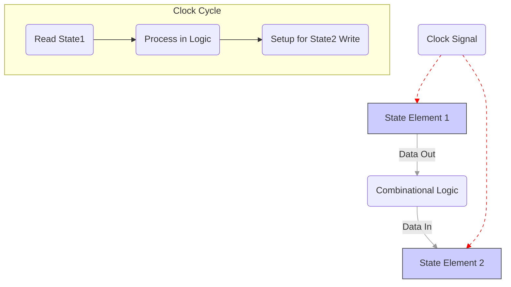
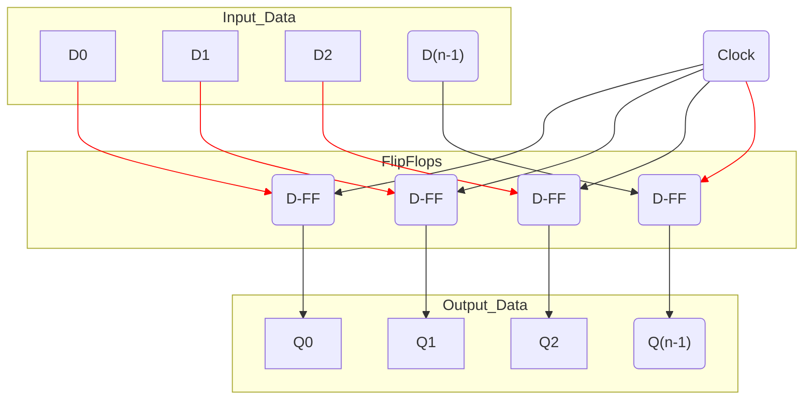
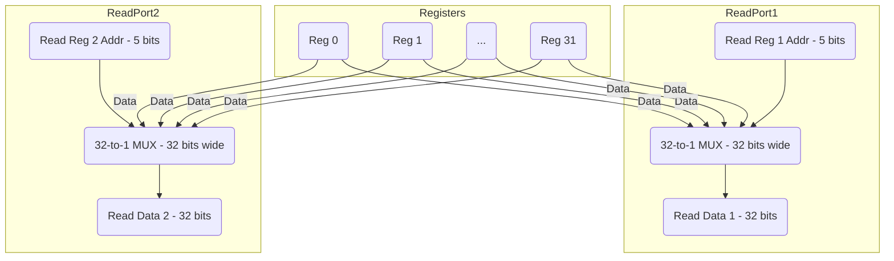
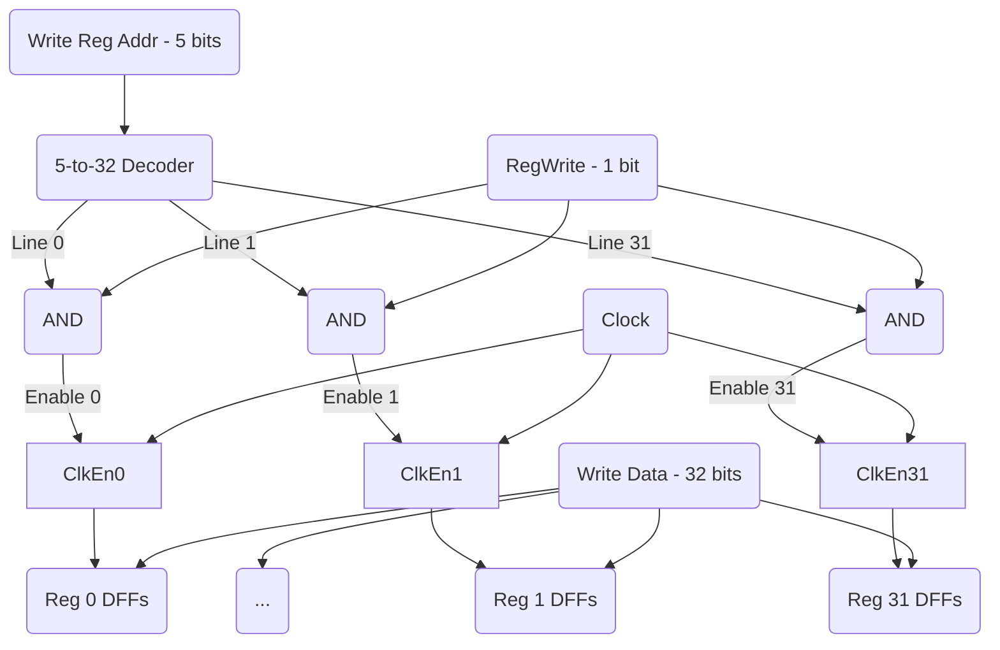

```table-of-contents
```
## 1 ⏳ לוגיקה סדרתית (Sequential Logic)

### 1.1 הגדרה ומאפיינים
***הקדמה**: מערכות דיגיטליות מודרניות מבוססות על לוגיקה עם **מצב (State)**, המשתנה בהתאם ל**שעון (Clock)**.
*   **הגדרה**: מעגלים לוגיים שהפלט שלהם תלוי לא רק בקלט הנוכחי, אלא גם ב**מצב הפנימי** של המעגל (היסטוריה/זיכרון).
*   **סוגי לוגיקה**:
    *   **קומבינטורית (Combinational)**: פלט תלוי רק בקלט (ALU, MUX, Decoder).
    *   **סדרתית (Sequential)**: פלט תלוי בקלט ובמצב הפנימי (רגיסטרים, זיכרון).
*   **רכיבי זיכרון**: לוגיקה סדרתית מכילה רכיבי מצב או רכיבי זיכרון (State/Memory Elements).
*   **סנכרון שעון**: רוב המערכות הסדרתיות הן **סינכרוניות**, ומשתמשות באות שעון כדי לתזמן את שינויי המצב ואת קריאת/כתיבת הנתונים.

### 1.2 שעון המחשב (Clock) 🕰️
***תפקיד**: מסדיר את קצב העבודה ומתזמן את הפעולות הבסיסיות במחשב.
*   **אות השעון**: אות חשמלי המחליף בין שני מצבים (גבוה '1' ונמוך '0') בקצב קבוע.
*   **מחזור שעון (Clock Cycle)**: הזמן המינימלי שבו התבנית חוזרת על עצמה. קובע את מהירות המעבד.
*   **קצוות השעון (Clock Edges)**:
    *   **עליית שעון (Rising Edge)**: מעבר מ-0 ל-1.
    *   **ירידת שעון (Falling Edge)**: מעבר מ-1 ל-0.
*   **מתודולוגיית תזמון (Clocking Methodology)**: מגדירה מתי אותות נקראים ומתי הם נכתבים ברכיבי הזיכרון.
    *   **Edge-Triggered Methodology**: השיטה הנפוצה. שינוי מצב (כתיבה לרכיב זיכרון) מתרחש **רק** בקצה מסוים של השעון (לרוב בעלייה או בירידה).
    *   **זרימה טיפוסית במחזור שעון (Edge-Triggered)**:
        1.  בקצה הפעיל של השעון: ערכים חדשים נכתבים לרכיבי הזיכרון.
        2.  בין קצוות השעון: ערכים נקראים מרכיבי הזיכרון, עוברים דרך הלוגיקה הקומבינטורית ומחושבים. התוצאות מתייצבות בכניסה לרכיבי הזיכרון הבאים, מוכנות לכתיבה בקצה השעון הבא.


*(זרימה כללית במערכת סדרתית מסונכרנת)*

## 2 💾 רכיבי זיכרון בסיסיים

### 2.1 לולאה (Latch) - S-R Latch
*   **רעיון**: מעגל עם משוב (Feedback) המאפשר לו "לזכור" סיבית אחת.
*   **מבנה בסיסי (S-R Latch מ-NOR)**: שני שערי NOR המוזנים זה לזה.
    *   כניסות: S (Set), R (Reset).
    *   יציאות: $\overline{Q}$, $Q$.
*   **פעולה**:
    *   **Set (S=1, R=0)**: כופה $Q=1$, $\overline{Q}=0$.
    *   **Reset (S=0, R=1)**: כופה $Q=0$, $\overline{Q}=1$.
    *   **Hold/Save (S=0, R=0)**: שומר על המצב הקיים ($Q$ נשאר כפי שהיה).
    *   **Illegal/Forbidden (S=1, R=1)**: מצב לא יציב ולא רצוי (שתי היציאות עלולות להיות 0).

> [!WARNING] S-R Latch Forbidden State
> יש להימנע ממצב הקלט S=1, R=1 בלולאת S-R בסיסית.

### 2.2 לולאת D (D-Latch)
*   **מטרה**: למנוע את המצב הלא-חוקי של S-R Latch.
*   **מבנה**: S-R Latch עם קלט יחיד D. הקלט R מחובר ל-NOT של D, והקלט S מחובר ישירות ל-D.
    *   כאשר D=1: S=1, R=0 -> Set (Q=1).
    *   כאשר D=0: S=0, R=1 -> Reset (Q=0).
*   **הוספת שעון (Clocked D-Latch)**:
    *   מוסיפים קו בקרה **Enable (E)** או **Clock (C)**.
    *   הלולאה יכולה לשנות את מצבה **רק** כאשר C=1 (או ברמה הלוגית הפעילה).
    *   כאשר C=1, $Q$ עוקב אחר $D$ (לאחר השהייה קצרה).
    *   כאשר C=0, הלולאה "נעולה" ושומרת על ערכה האחרון, ללא תלות בשינויים ב-D.

> [!NOTE] Level-Sensitive Latch
> D-Latch מסונכרן הוא **Level-Sensitive**. כל עוד השעון ברמה הפעילה (למשל, גבוה), שינויים בקלט D ישפיעו על הפלט Q. זה עלול לגרום לבעיות במערכות מורכבות אם האותות לא מתייצבים מספיק מהר.

### 2.3 פליפ-פלופ D (D Flip-Flop) 💾
*   **מטרה**: לפתור את בעיית הרגישות לרמה (Level-Sensitivity) של ה-Latch.
*   **מאפיין**: **Edge-Triggered** - משנה את מצבו (הפלט Q) **רק** ברגע המעבר (הקצה הפעיל) של אות השעון (לרוב, עליית שעון).
*   **מימוש נפוץ (Master-Slave)**:
    1.  מורכב משתי D-Latches בטור (Master ו-Slave).
    2.  השעון המגיע ל-Slave הוא **הפוך** מהשעון המגיע ל-Master.
    3.  **פעולה**:
        *   **כשהשעון עולה (C=1)**: ה-Master Latch קולט את הערך מ-D, אך ה-Slave Latch נעול (מקבל C=0).
        *   **כשהשעון יורד (C=0)**: ה-Master Latch נעול (שומר על הערך שקלט), וה-Slave Latch נפתח (מקבל C=1) ומעתיק את הערך מה-Master ליציאה הסופית Q.
    *   **תוצאה**: הפלט Q מתעדכן רק פעם אחת במחזור שעון, בירידת השעון (במימוש זה, או בעליית השעון במימושים אחרים).

> [!IMPORTANT] Edge-Triggered Behavior
> הפליפ-פלופ דוגם את הקלט D ברגע המעבר של השעון ומעדכן את הפלט Q בהתאם. שינויים ב-D בין קצוות השעון אינם משפיעים ישירות על הפלט עד לקצה השעון הבא.

### 2.4 אוגר (Register)
*   **הגדרה**: רכיב זיכרון המסוגל לאחסן קבוצה של סיביות (לרוב מילה, למשל 32 סיביות).
*   **מימוש**: בנוי מסדרה של D Flip-Flops (אחד לכל סיבית), המחוברים לאותו קו שעון (Clock) ולאותו קו בקרה לכתיבה (Write Enable).
*   כל הסיביות נקראות ונכתבות בו-זמנית, מסונכרן עם השעון.


*(מבנה סכמטי של אוגר N-סיביות)*

## 3 🗃️ בניית מקבץ האוגרים (Register File)

### 3.1 דרישות ותכונות (עבור MIPS)
*   אוסף של 32 אוגרים, כל אחד ברוחב 32 סיביות.
*   יכולת **לקרוא** בו-זמנית משני אוגרים שונים. (2 Read Ports)
*   יכולת **לכתוב** לאוגר אחד בכל פעם. (1 Write Port)
*   הכתיבה מסונכרנת עם השעון ומבוקרת ע"י אות Write Enable.
*   **כניסות**:
    *   `Read Register 1` (5 סיביות - כתובת rs)
    *   `Read Register 2` (5 סיביות - כתובת rt)
    *   `Write Register` (5 סיביות - כתובת rd)
    *   `Write Data` (32 סיביות - הנתון לכתיבה)
    *   `RegWrite` (1 סיבית - Write Enable)
    *   `Clock`
*   **יציאות**:
    *   `Read Data 1` (32 סיביות - תוכן אוגר rs)
    *   `Read Data 2` (32 סיביות - תוכן אוגר rt)

### 3.2 מימוש קריאה (Read Ports)
*   הקריאה היא פעולה **קומבינטורית** (לא דורשת שעון).
*   כל פורט קריאה ממומש באמצעות **MUX גדול (32-to-1)** ברוחב 32 סיביות.
*   קווי הבחירה (Select Lines) של ה-MUX הם 5 סיביות כתובת הרגיסטר לקריאה (`Read Register 1` או `Read Register 2`).
*   כל אחת מ-32 הכניסות של ה-MUX מחוברת ליציאה של אוגר אחר בקובץ.
*   ה-MUX בורר את היציאה של האוגר המבוקש ומוציא אותה כ-`Read Data 1` או `Read Data 2`.


*(מימוש סכמטי של שני פורטי הקריאה)*

### 3.3 מימוש כתיבה (Write Port)
*   הכתיבה היא פעולה **סדרתית**, מסונכרנת עם השעון ומבוקרת.
*   משתמשים ב-**Decoder (5-to-32)** כדי לבחור את האוגר שאליו רוצים לכתוב.
    *   קלט המפענח: 5 סיביות כתובת רגיסטר היעד (`Write Register`).
    *   פלט המפענח: 32 קווים, רק אחד מהם יהיה פעיל (1).
*   קו ה-Write Enable הראשי (`RegWrite`) משולב עם יציאת המפענח באמצעות שערי AND, כדי לייצר אות Enable ספציפי לכל אוגר (D Flip-Flop).
*   האות `Write Enable` הספציפי של כל אוגר מפעיל את כניסת השעון (או כניסת Enable ייעודית) של ה-Flip-Flops באותו אוגר.
*   אפיק ה-`Write Data` (32 סיביות) מחובר **לכניסות D** של **כל** האוגרים.
*   **רק** האוגר שנבחר ע"י המפענח **וגם** `RegWrite` פעיל, יקלוט את הנתון מ-`Write Data` בקצה הפעיל של השעון.

> [!NOTE] Register $zero Write
> הכתיבה לאוגר 0 ($zero) חסומה חומרתית (קו ה-Enable שלו תמיד 0).


*(מימוש סכמטי של פורט הכתיבה)*