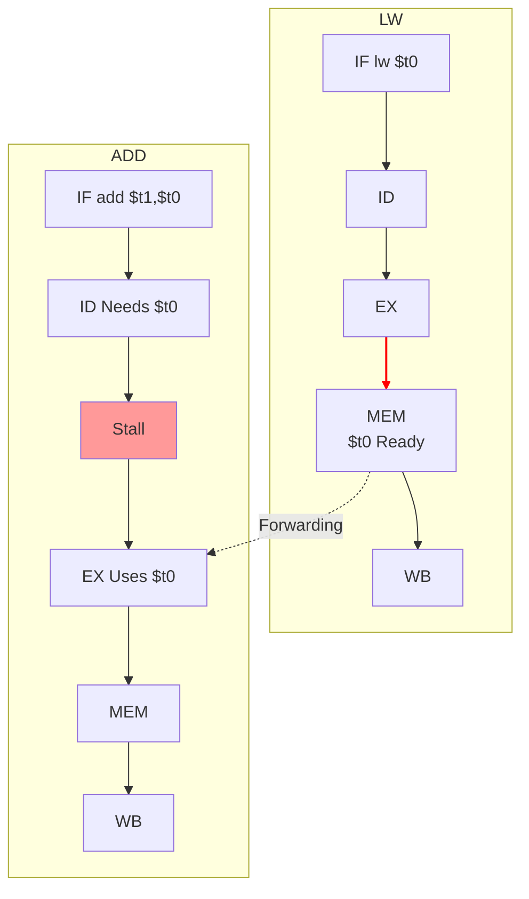

```table-of-contents
```
## 1. ⚠️ סיכוני נתונים (Data Hazards) - (מפגש 8)

### 1.1 הגדרה והדגמה

###### הבעיה: RAW (Read After Write)
*   **הגדרה**: סיכון נתונים מתרחש כאשר פקודה ב-Pipeline מנסה להשתמש בתוצאה של פקודה קודמת, שעדיין לא סיימה את ביצועה ולא כתבה את התוצאה חזרה ליעדה (לרוב, קובץ הרגיסטרים).
*   **סוג עיקרי (RAW)**: פקודה מנסה **לקרוא** (Read) רגיסטר **אחרי** (After) שפקודה קודמת אמורה **לכתוב** (Write) אליו, אך הכתיבה טרם בוצעה.
*   **דוגמה**:
    ```mips
    sub $2, $1, $3   # כותב ל-$2 בשלב WB (מחזור 5)
    and $12, $2, $5  # קורא את $2 בשלב ID (מחזור 3) - HAZARD!
    or $13, $6, $2   # קורא את $2 בשלב ID (מחזור 4) - HAZARD!
    add $14, $2, $2  # קורא את $2 בשלב ID (מחזור 5) - ללא Hazard (חצי מחזור)
    ```
    במצב זה, פקודות `and` ו-`or` יקראו ערך ישן ולא מעודכן של `$2` אם לא יטופל הסיכון.

```mermaid
graph TD
    subgraph Clock_Cycles
        direction LR
        CC1 --> CC2 --> CC3 --> CC4 --> CC5 --> CC6 --> CC7;
    end
    subgraph SUB_Instruction
        SUB_IF[IF sub $2] --> SUB_ID[ID] --> SUB_EX[EX Result -20] --> SUB_MEM[MEM] --> SUB_WB[WB Write $2];
    end
    subgraph AND_Instruction
        AND_IF[IF and $12,$2] --> AND_ID[ID Needs $2<br>Reads old val 10] --> AND_EX[EX uses 10];
        AND_EX --> AND_MEM[MEM];
        AND_MEM --> AND_WB[WB];
    end
    subgraph OR_Instruction
        OR_IF[IF or $13,$6,$2] --> OR_ID[ID Needs $2<br>Reads old val 10] --> OR_EX[EX uses 10];
        OR_EX --> OR_MEM[MEM];
        OR_MEM --> OR_WB[WB];
    end

    CC1 --> SUB_IF;
    CC2 --> SUB_ID; CC2 --> AND_IF;
    CC3 --> SUB_EX; CC3 --> AND_ID; CC3 --> OR_IF;
    CC4 --> SUB_MEM; CC4 --> AND_EX; CC4 --> OR_ID;
    CC5 --> SUB_WB; CC5 --> AND_MEM; CC5 --> OR_EX;
    CC6 --> AND_WB; CC6 --> OR_MEM;
    CC7 --> OR_WB;

    classDef hazard fill:#f99;
    class AND_ID, OR_ID hazard;

```
*(הדגמת ה-Hazard בזמן)*

### 1.2 פתרון 1: הוספת NOPs (Stalling / Bubbles)
*   הכנסת פקודות `nop` (שלא עושות כלום) אחרי הפקודה הכותבת, כדי לעכב את הפקודה הקוראת עד שהנתון ייכתב ל-Register File ויהיה זמין לקריאה.
*   בדוגמה לעיל, נדרשים 2 `nop`s אחרי ה-`sub` כדי שפקודת `and` תקרא את הערך הנכון.
*   **חסרון**: מבזבז מחזורי שעון (מגדיל CPI), פוגע בביצועים.

### 1.3 פתרון 2: Forwarding / Bypassing (העברה קדימה / עקיפה)
*   **רעיון**: התוצאה מה-ALU (בסוף שלב EX) או מהזיכרון (בסוף שלב MEM) זמינה **מוקדם יותר** משהיא נכתבת ל-Register File (בשלב WB). ניתן להעביר אותה **ישירות** דרך קווים נוספים (Bypass paths) לכניסת ה-ALU (בתחילת שלב EX) של הפקודה הבאה שזקוקה לה.
*   **מימוש חומרתי**:
    *   **Forwarding Unit**: יחידה לוגית קומבינטורית שמזהה תלות RAW בין הפקודות בשלבי EX, MEM, WB לבין הפקודה בשלב ID/EX.
    *   **תנאי זיהוי (לדוגמה, ForwardA עבור קלט Rs)**:
        1.  **EX Hazard**: האם הפקודה ב-EX/MEM כותבת לרגיסטר (`RegWrite=1`), והרגיסטר הזה אינו `$0`, והוא זהה ל-Rs של הפקודה ב-ID/EX?
        2.  **MEM Hazard**: האם הפקודה ב-MEM/WB כותבת לרגיסטר, והוא אינו `$0`, והוא *אינו* זהה ליעד של פקודת ה-EX Hazard (כדי לתת עדיפות לערך החדש יותר מה-EX), והוא זהה ל-Rs של הפקודה ב-ID/EX?
    *   **MUXים בכניסות ל-ALU**: מוספים MUXים בעלי 3 כניסות לכל קלט של ה-ALU:
        *   00: קח מה-Register File (ברירת מחדל).
        *   01: קח מהתוצאה ברגיסטר MEM/WB (Forwarding מ-MEM).
        *   10: קח מ-ALUOut ברגיסטר EX/MEM (Forwarding מ-EX).
    *   ה-Forwarding Unit שולטת ב-MUXים אלו (`ForwardA`, `ForwardB`).

```mermaid
graph TD
    subgraph Pipeline_Registers
        ID_EX(ID/EX Reg);
        EX_MEM(EX/MEM Reg);
        MEM_WB(MEM/WB Reg);
    end

    subgraph Logic_Units
        RF(Register File);
        ALU(ALU);
    end

    ForwardUnit(Forwarding Unit);

    ID_EX -- RegRsAddr, RegRtAddr --> RF; # Read Addrs still go to RF
    RF -- ReadData1 --> MUX_A(MUX ForwardA);
    RF -- ReadData2 --> MUX_B(MUX ForwardB);

    MUX_A -- SelectedData1 --> ALU;
    MUX_B -- SelectedData2 --> ALU;

    EX_MEM -- ALUResult --> ForwardUnit;
    MEM_WB -- WB_Data --> ForwardUnit; # WB_Data can be ALURes or MemData

    EX_MEM -- DestRegAddr --> ForwardUnit;
    MEM_WB -- DestRegAddr --> ForwardUnit;
    ID_EX -- SourceRegAddrs --> ForwardUnit;

    ForwardUnit -- ForwardA_Sel --> MUX_A;
    ForwardUnit -- ForwardB_Sel --> MUX_B;

    EX_MEM -- ALUResult --> MUX_A;
    EX_MEM -- ALUResult --> MUX_B;
    MEM_WB -- WB_Data --> MUX_A;
    MEM_WB -- WB_Data --> MUX_B;

    classDef pipeReg fill:#f9f,stroke:#333;
    class ID_EX,EX_MEM,MEM_WB pipeReg;
    classDef logic fill:#eee,stroke:#333;
    class RF, ALU, ForwardUnit logic;

```
*(קונספט של Forwarding Unit ו-MUXים בכניסה ל-ALU)*

> [!TIP] Forwarding Effectiveness
> Forwarding פותר את **רוב** סיכוני ה-RAW ללא צורך ב-Stalls, מה שמשפר משמעותית את ביצועי ה-Pipeline.

### 1.4 מקרה מיוחד: Load-Use Hazard

###### הבעיה
*   כאשר פקודה (כמו `add`) תלויה **מיד** בתוצאה של פקודת `lw` קודמת.
*   הנתון מפקודת `lw` זמין **רק בסוף שלב MEM**.
*   Forwarding יכול להעביר את הנתון הזה רק לשלב **MEM** של הפקודה הבאה, אך הפקודה הבאה צריכה אותו כבר בשלב **EX**. Forwarding "אחורה בזמן" אינו אפשרי.

###### הפתרון: Stall אחד + Forwarding
*   **Hazard Detection Unit (HDU)**: יחידה לוגית נוספת שמזהה ספציפית את מצב ה-Load-Use בשלב **ID**:
    *   **תנאי זיהוי**: האם הפקודה ב-ID/EX היא `lw` (`MemRead=1`) **וגם** האם רגיסטר היעד שלה (`rt` ב-ID/EX) שווה לאחד מרגיסטרי המקור (`rs` או `rt`) של הפקודה הבאה (שנמצאת כעת ב-IF/ID)?
*   **פעולה בעת זיהוי**:
    1.  **Stall**: מעכבת את הפקודה התלויה (שב-IF/ID) ואת הבאת הפקודה שאחריה (ע"י ביטול כתיבה ל-PC ול-IF/ID).
    2.  **Bubble**: מכניסה "בועה" (NOP וירטואלי) לרגיסטר ID/EX (ע"י איפוס אותות הבקרה).
*   **תוצאה**: הפקודה התלויה מתעכבת במחזור אחד. ה-`lw` מתקדם לשלב MEM. במחזור הבא, הפקודה התלויה מגיעה לשלב EX, וה-`lw` מגיע לשלב WB. כעת, Forwarding **משלב MEM של ה-`lw`** (דרך רגיסטר EX/MEM) לכניסת ה-ALU **של הפקודה התלויה (בשלב EX)** אפשרי ועובד.


*(דיאגרמת Load-Use Hazard פשוטה)*

> [!NOTE] MIPS History & Delayed Load
> במעבדי MIPS מוקדמים, לא היה מימוש חומרתי ל-Stall ב-Load-Use Hazard (לא היה Interlock). זו אחת הסיבות לשם "Microprocessor without Interlocked Pipeline Stages". במקום זאת, האחריות הייתה על המהדר להכניס `nop` או לסדר מחדש את הקוד. זה נקרא **Delayed Load**.

### 1.5 פתרון תוכנתי: Instruction Reordering
*   המהדר (Compiler) יכול לנסות לשנות את סדר הפקודות כדי להגדיל את המרחק בין פקודה כותבת לפקודה תלויה, במיוחד כדי להימנע מה-Stall של Load-Use.

---

## 2. 🚦 סיכוני בקרה (Control Hazards) ופסיקות (מפגש 10)

### 2.1 סיכוני בקרה (Branch Hazards)

###### הבעיה
*   פקודות Branch (`beq`, `bne`) משנות את ה-PC רק אם התנאי מתקיים.
*   ההחלטה והכתובת היעד מחושבים בשלב מאוחר ב-Pipeline (במימוש פשוט, ב-EX; במימוש משופר, ב-ID).
*   עד אז, ה-Pipeline כבר הכניס פקודות שאחרי ה-Branch (בהנחה שלא קופצים).
*   אם ה-Branch כן נלקח, הפקודות השגויות שהוכנסו צריכות להתבטל (**Flush**).

###### פתרונות

##### Stall (הקפאה)
*   עצירת ה-Pipeline אחרי זיהוי ה-Branch עד שההחלטה והיעד ידועים.
*   **חסרון**: יקר - Penalty של מספר מחזורי שעון (תלוי בשלב קבלת ההחלטה).

##### הזזת חישוב ה-Branch לשלב ID
*   הוספת חומרה לשלב ID (Comparator, Adder) מאפשרת קבלת החלטה מוקדמת יותר.
*   **יתרון**: מקטין את ה-Penalty ל-**Stall אחד** בלבד (צריך לבטל רק את הפקודה בשלב IF).
*   **חסרון**: עלול ליצור Data Hazards חדשים אם ה-Branch תלוי בתוצאה של `lw` קודם.

##### Branch Prediction (ניבוי)
*   **רעיון**: לנחש את תוצאת ה-Branch ולהמשיך בביצוע ספקולטיבי. אם הניחוש שגוי, מבצעים Flush.
    *   **Predict Not Taken (סטטי)**: מנחשים שה-Branch לא יילקח. יעיל ללולאות עם תנאי יציאה בסוף. ה-Penalty הוא רק כאשר ה-Branch נלקח.
    *   **Predict Taken (סטטי)**: מנחשים שה-Branch יילקח. דורש חישוב יעד מוקדם, ועדיין עשוי לגרום ל-Stall.
*   **Dynamic Branch Prediction**: החומרה לומדת את התנהגות ה-Branches בזמן ריצה.
    *   **BHT (Branch History Table)**: טבלה קטנה המנבאת לפי ההיסטוריה האחרונה של אותו Branch (לרוב ממופתת לפי כתובת ה-Branch).
        *   *1-Bit Predictor*: זוכר רק את הפעם האחרונה. טועה פעמיים בלולאה.
        *   *2-Bit Predictor*: FSM עם 4 מצבים (Strongly/Weakly Taken/Not Taken). דורש 2 טעויות רצופות לשינוי ניבוי קיצוני. משפר דיוק משמעותית (מעל 90%).
    *   **BTB (Branch Target Buffer)**: Cache השומר גם את **כתובת היעד** של Branches שנלקחו בעבר. מאפשר, בשילוב עם ניבוי Taken, להתחיל Fetch מהיעד **מיד** בשלב IF, ובכך פוטנציאלית להעלים את ה-Penalty לחלוטין אם הניבוי נכון.

##### Branch Delay Slot
*   **הגדרה מחודשת של ISA**: הפקודה בכתובת `PC+4` (שאחרי ה-Branch) מתבצעת **תמיד**.
*   **תפקיד המהדר**: למלא את ה-"Slot" הזה בפקודה שימושית (שאינה תלויה בתוצאת ה-Branch) או ב-`nop`.
*   **יתרון**: יכול להעלים את ה-Penalty (אם המהדר מצליח).
*   **חסרון**: מסבך את המהדר, חושף את ה-Pipeline. (היה קיים ב-MIPS קלאסי).

### 2.2 פסיקות וחריגות (Interrupts and Exceptions)

###### הגדרה
*   אירועים לא צפויים המשנים את זרימת הבקרה.
*   **Exception (חריגה)**: אירוע **פנימי** למעבד כתוצאה מביצוע פקודה (Arithmetic Overflow, Undefined Instruction, Page Fault, Syscall). סינכרוני.
*   **Interrupt (פסיקה)**: אירוע **חיצוני** למעבד (בקשת I/O, Timer). א-סינכרוני.

###### מנגנון טיפול ב-MIPS
1.  **זיהוי**: החומרה מזהה את האירוע בשלב המתאים ב-Pipeline.
2.  **שמירת מידע (ב-Coprocessor 0)**:
    *   **`EPC (Exception PC)`**: כתובת הפקודה שגרמה לחריגה (או הפקודה שהייתה אמורה להתבצע הבאה במקרה של פסיקה).
    *   **`Cause Register`**: קוד המציין את סיבת האירוע (סוג החריגה/הפסיקה).
3.  **העברת בקרה ל-OS**: ה-PC נטען בכתובת קבועה ומוגדרת מראש של **שגרת הטיפול (Exception Handler)** בתוך מרחב הכתובות של מערכת ההפעלה (Kernel).
4.  **ביצוע ה-Handler (קוד OS)**:
    *   שומר רגיסטרים נוספים של התוכנית שנעצרה.
    *   בודק את רגיסטר `Cause` לזיהוי הסיבה.
    *   מבצע את הטיפול הנדרש.
    *   משחזר רגיסטרים.
    *   חוזר לתוכנית המקורית (לרוב לכתובת השמורה ב-`EPC`) באמצעות פקודה מיוחדת (כמו `eret`).

###### טיפול ב-Pipeline

> [!IMPORTANT] Precise Exceptions
> ה-Pipeline חייב להבטיח טיפול "מדויק": כל הפקודות *לפני* הפקודה הבעייתית משלימות את ביצוען, וכל הפקודות *אחריה* מתבטלות (Flush) כאילו לא התחילו כלל.

*   **זיהוי**: חריגות יכולות להתרחש בשלבים שונים (Undefined Instruction ב-ID, Overflow ב-EX, Page Fault ב-IF/MEM).
*   **פעולה**:
    1.  החריגה מזוהה בשלב המתאים.
    2.  אותות הכתיבה (RegWrite, MemWrite) עבור הפקודה הבעייתית וכל הפקודות שאחריה ב-Pipeline מבוטלים (הופכים ל-0).
    3.  כשהפקודה הבעייתית מגיעה לשלב WB, המידע נשמר ב-EPC ו-Cause, וה-PC נטען בכתובת ה-Handler.
*   **פסיקות מרובות**: אם מספר חריגות מתרחשות בפקודות שונות הנמצאות ב-Pipeline בו-זמנית, החומרה נותנת עדיפות לזו ששייכת לפקודה **המוקדמת ביותר** לפי סדר התוכנית המקורי.

---
## 3. 🚀 שיפורי Pipeline נוספים

###### Superpipelining
*   הגדלת עומק ה-Pipeline (יותר מ-5 שלבים). מאפשר CCT קצר יותר, אך מגדיל את ה-Penalty של Hazards.

###### Dynamic Pipeline Scheduling
*   החומרה משנה את סדר ביצוע הפקודות (Out-of-Order Execution) כדי למלא "בועות". מורכב מאוד.

###### Superscalar
*   ביצוע **מספר פקודות במקביל** בכל שלב ב-Pipeline. דורש הכפלת חומרה משמעותית (מספר יחידות Fetch, Decode, ALU וכו').