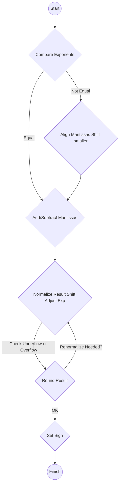

```table-of-contents
```
## 1. 🔢 ייצוג מספרים רציונליים (נקודה צפה)

### 1.1 מבוא: נקודה קבועה מול נקודה צפה

###### נקודה קבועה (Fixed Point)
*   הדרך שבה ייצגנו מספרים שלמים (signed/unsigned) עד כה.
*   מיקום ה"נקודה הבינארית" (המפרידה בין החלק השלם לחלק השברי) **קבוע** מראש ואינו נשמר במפורש. לדוגמה, בייצוג שלם רגיל, הנקודה נמצאת תמיד מימין לסיבית הפחות משמעותית (LSB).

###### נקודה צפה (Floating Point)
*   דרך גמישה יותר לייצג מספרים ממשיים (כולל שברים) בטווח ערכים רחב מאוד.
*   מבוסס על ייצוג **מדעי** בבסיס 2: $Number = \pm Mantissa \times 2^{Exponent}$
    *   **מנטיסה (Mantissa/Significand)**: מייצגת את הספרות המשמעותיות של המספר (החלק השברי).
    *   **אקספוננט (Exponent)**: מייצג את החזקה של 2, הקובעת את מיקום הנקודה הצפה.
    *   **סימן (Sign)**: מייצג אם המספר חיובי או שלילי.

### 1.2 תקן IEEE 754 📜
*   התקן הנפוץ ביותר בעולם לייצוג ואריתמטיקה של מספרי נקודה צפה, פורסם ב-1985.
*   נועד ליצור סטנדרטיזציה ולהבטיח תאימות בין מערכות שונות.
*   מגדיר פורמטים עיקריים, ערכים מיוחדים וכללי עיגול.

### 1.3 פורמטים עיקריים ב-IEEE 754

###### Float (Single Precision) - 32 סיביות
*   **מבנה**:
    *   **סימן (Sign)**: סיבית אחת (0 לחיובי, 1 לשלילי).
    *   **אקספוננט (Exponent)**: 8 סיביות, מיוצגות עם **Bias של 127**.
        *   הערך האמיתי של האקספוננט הוא: $E_{actual} = E_{stored} - 127$.
    *   **מנטיסה (Mantissa/Fraction)**: 23 סיביות (מייצגות את החלק ש*אחרי* הנקודה הבינארית).
*   **מבנה בזיכרון**: `| S (1) | Exponent (8) | Fraction (23) |`

###### Double (Double Precision) - 64 סיביות
*   **מבנה**:
    *   **סימן (Sign)**: סיבית אחת.
    *   **אקספוננט (Exponent)**: 11 סיביות, מיוצגות עם **Bias של 1023**.
        *   הערך האמיתי: $E_{actual} = E_{stored} - 1023$.
    *   **מנטיסה (Mantissa/Fraction)**: 52 סיביות.
*   **מבנה בזיכרון**: `| S (1) | Exponent (11) | Fraction (52) |`

### 1.4 נרמול והסיבית הנסתרת (Hidden Bit)

*   **צורה מנורמלת**: בתקן IEEE 754 (למעט מקרים מיוחדים), המנטיסה מיוצגת תמיד בצורה שבה יש ספרה **1** בודדת **לפני** הנקודה הבינארית.
    *   לדוגמה: $1.fraction \times 2^{exponent}$
*   **הסיבית הנסתרת**: מכיוון שהספרה שלפני הנקודה היא **תמיד 1** בצורה המנורמלת, אין צורך לאחסן אותה בזיכרון. היא "מובלעת" או "נסתרת" (Hidden Bit).
*   **שחזור ערך**: כדי לשחזר את ערך המנטיסה המלא, מוסיפים 1 לפני הנקודה לחלק השברי (Fraction) המאוחסן.
    *   ערך המספר: $Value = (-1)^S \times (1.Fraction)_2 \times 2^{(Exponent - Bias)}$

### 1.5 טווחי ערכים ומקרים מיוחדים (עבור Float)

###### טווח ערכים נורמליים
*   נקבע ע"י ערכי האקספוננט המינימלי והמקסימלי המותרים (לא 0 ולא 255).
*   ערך מקסימלי (חיובי): $\approx (1.11...1)_2 \times 2^{(254-127)} \approx 2 \times 2^{127} \approx 3.4 \times 10^{38}$
*   ערך מינימלי (חיובי): $(1.00...0)_2 \times 2^{(1-127)} = 1 \times 2^{-126} \approx 1.17 \times 10^{-38}$

###### ערכים מיוחדים (נקבעים לפי ערך האקספוננט המאוחסן)
*   **אפס (Zero)**:
    *   Exponent = 0, Fraction = 0.
    *   קיים +0 (S=0) ו--0 (S=1).
*   **Denormalized Numbers**:
    *   Exponent = 0, Fraction $\ne$ 0.
    *   מספרים קטנים מאוד, קרובים לאפס. הסיבית המובלעת היא 0 ולא 1.
    *   ערך: $(-1)^S \times (0.Fraction)_2 \times 2^{-126}$.
*   **אינסוף (Infinity)**:
    *   Exponent = 255 (כל הסיביות 1), Fraction = 0.
    *   קיים $+\infty$ (S=0) ו--$\infty$ (S=1). נגרם מגלישה או חלוקה באפס.
*   **NaN (Not a Number)**:
    *   Exponent = 255, Fraction $\ne$ 0.
    *   מייצג תוצאה לא מוגדרת (למשל, $0/0$, $\infty - \infty$, $\sqrt{-1}$).

*(הערות דומות קיימות עבור Double, עם טווחים ו-Bias שונים)*

### 1.6 המרת מספרים

#### 1.6.1 המרה עשרוני לנקודה צפה (IEEE 754 Float)
1.  המר את המספר העשרוני לייצוג בינארי (כולל החלק השברי).
2.  נרמל את המספר הבינארי לצורה: $\pm 1.fraction \times 2^{exponent}$.
3.  קבע את סיבית הסימן (S).
4.  חשב את האקספוננט המאוחסן: $Exponent_{stored} = Exponent_{actual} + 127$. המר לייצוג בינארי של 8 סיביות.
5.  קח את 23 הסיביות הראשונות של ה-Fraction (החלק שאחרי הנקודה במנטיסה המנורמלת).
6.  חבר את שלושת החלקים (S | Exponent | Fraction) לייצוג ה-32 סיביות.
*   **דוגמה**: המרת 12.125
    1.  $(12.125)_{10} = (1100.001)_2$
    2.  נרמול: $1.100001 \times 2^3$ ($exponent=3$)
    3.  סימן: S=0 (חיובי)
    4.  אקספוננט מאוחסן: $3 + 127 = 130 = (10000010)_2$
    5.  Fraction: $10000100000000000000000$ (23 סיביות)
    6.  תוצאה: `0 10000010 10000100000000000000000`

#### 1.6.2 המרת נקודה צפה לעשרוני
1.  פרק את הייצוג ל-S, Exponent, Fraction.
2.  חשב את האקספוננט האמיתי: $E_{actual} = E_{stored} - Bias$ (127 ל-Float, 1023 ל-Double).
3.  שחזר את המנטיסה המלאה (עם הסיבית הנסתרת): $1.Fraction$.
4.  חשב את הערך: $(-1)^S \times (1.Fraction)_2 \times 2^{E_{actual}}$.
5.  המר את התוצאה הבינארית לעשרוני.

#### 1.6.3 המרת שבר פשוט לבינארי
*   עבור שבר $x$ בין 0 ל-1:
    1.  התחל עם "0.".
    2.  בכל שלב, כפול את $x$ ב-2.
    3.  אם התוצאה $\ge 1$, רשום "1" והחסר 1 מהתוצאה כדי לקבל את $x$ החדש.
    4.  אם התוצאה $< 1$, רשום "0" והשאר את התוצאה כ-$x$ החדש.
    5.  חזור על הפעולה עד ש-$x=0$ או עד שמגיעים למספר הסיביות הרצוי (עבור ייצוג סופי).
*   **דוגמה**: המרת 1/3
    *   0.
    *   1/3 * 2 = 2/3 (< 1) -> 0.0
    *   2/3 * 2 = 4/3 (>= 1) -> 0.01, x = 4/3 - 1 = 1/3
    *   1/3 * 2 = 2/3 (< 1) -> 0.010
    *   ... התהליך מחזורי: $(1/3)_{10} = (0.010101...)_2$

---

## 2. ➕➖ פעולות אריתמטיות בנקודה צפה

> [!IMPORTANT] Floating Point Arithmetic is Complex
> פעולות אריתמטיות בנקודה צפה מורכבות יותר מאשר על מספרים שלמים, בעיקר בגלל הצורך לטפל באקספוננטים ובמנטיסות בנפרד, ובגלל הצורך בנרמול ועיגול.

### 2.1 חיבור / חיסור
1.  **השוואת אקספוננטים**:
    *   מצא את המספר עם האקספוננט **הקטן** יותר.
    *   **הזז ימינה** את המנטיסה שלו (כולל הסיבית הנסתרת) והגדל את האקספוננט שלו בהתאם, עד שהאקספוננטים יהיו שווים. כל הזזה ימינה ב-1 מגדילה את האקספוננט ב-1.
2.  **חיבור/חיסור מנטיסות**:
    *   חבר (או חסר, בהתאם לסימנים המקוריים ולפעולה) את שתי המנטיסות (המיושרות לאותו אקספוננט).
3.  **נרמול התוצאה**:
    *   **אם התוצאה לא מנורמלת** (אין '1' לפני הנקודה, או שיש יותר מספרה אחת), הזז את הנקודה ואת המנטיסה ימינה או שמאלה עד שהיא בצורה מנורמלת ($1.fraction$).
    *   עדכן את האקספוננט בהתאם למספר ההזזות (הזזה שמאלה מקטינה אקספוננט, הזזה ימינה מגדילה).
    *   **בדיקת Underflow/Overflow**: ודא שהאקספוננט החדש נמצא בטווח המותר.
4.  **עיגול (Rounding)**:
    *   אם במהלך ההזזות "נפלו" סיביות מימין למנטיסה, יש לעגל את התוצאה לפי כללי העיגול של IEEE 754 (לרוב Round to nearest, ties to even).
    *   ייתכן שעיגול יגרום שוב לאי-נרמול (למשל, 1.11...1 יעוגל ל-10.00...0), מה שמצריך **שלב נרמול נוסף**.
5.  **קביעת סימן**: סימן התוצאה נקבע לפי סימני האופרנדים והפעולה.


*(אלגוריתם חיבור/חיסור נקודה צפה)*

### 2.2 כפל
1.  **חיבור אקספוננטים**: חבר את שני האקספוננטים המאוחסנים והחסר את ה-Bias (כי הוא נכלל פעמיים).
2.  **כפל מנטיסות**: כפול את שתי המנטיסות (כולל הסיבית הנסתרת).
3.  **נרמול התוצאה**: התוצאה תהיה בצורה `xx.xxxx` או `x.xxxx`. הזז את הנקודה שמאלה (אם צריך) ועדכן את האקספוננט.
4.  **עיגול**: עגל את המנטיסה למספר הסיביות הזמין.
5.  **קביעת סימן**: סימן התוצאה הוא XOR של סימני האופרנדים.
6.  **בדיקת Underflow/Overflow**.

### 2.3 חילוק
1.  **חיסור אקספוננטים**: חסר את האקספוננט של המחלק מזה של המחולק, והוסף את ה-Bias.
2.  **חילוק מנטיסות**: חלק את המנטיסות (כולל הסיבית הנסתרת).
3.  **נרמול התוצאה**: הזז את הנקודה (אם צריך) ועדכן אקספוננט.
4.  **עיגול**.
5.  **קביעת סימן**: XOR של סימני האופרנדים.
6.  **בדיקת Underflow/Overflow**.

---
## 3. ⌨️ פקודות נקודה צפה ב-MIPS

### 3.1 יחידת הנקודה הצפה (Coprocessor 1)
*   ב-MIPS, פעולות נקודה צפה מבוצעות ע"י יחידת חומרה נפרדת הנקראת **Coprocessor 1 (CP1)**.
*   ל-CP1 יש סט **רגיסטרים** משלו: **32 רגיסטרי נקודה צפה (`$f0` - `$f31`)**.
    *   כל רגיסטר `$f` יכול להכיל ערך **Single Precision** (32 סיביות).
    *   ניתן להשתמש **בזוגות** של רגיסטרים (למשל `$f0`, `$f1`) כדי להכיל ערך **Double Precision** (64 סיביות). נתייחס בעיקר ל-Single.
*   סט פקודות נפרד מתחיל לרוב ב-`.s` (ל-Single) או `.d` (ל-Double).

### 3.2 פקודות אריתמטיות (Single Precision)
*   רובן בפורמט דמוי **R-Type** עם שינויים קלים. Opcode ראשוני הוא 17 (010001), ושדה `fmt` מציין S=16 / D=17. הפעולה נקבעת ע"י `funct`.
*   `op | fmt | ft | fs | fd | funct`
    *   `fd`: רגיסטר יעד.
    *   `fs`, `ft`: רגיסטרי מקור.

| פקודה | פעולה             | דוגמה            |
| :------ | :----------------- | :--------------- |
| `add.s` | `$fd = $fs + $ft`  | `add.s $f0,$f2,$f4` |
| `sub.s` | `$fd = $fs - $ft`  | `sub.s $f0,$f2,$f4` |
| `mul.s` | `$fd = $fs * $ft`  | `mul.s $f0,$f2,$f4` |
| `div.s` | `$fd = $fs / $ft`  | `div.s $f0,$f2,$f4` |
| `abs.s` | `$fd = abs($fs)`   | `abs.s $f0,$f2`    |
| `neg.s` | `$fd = - $fs`      | `neg.s $f0,$f2`    |
| `sqrt.s`| `$fd = sqrt($fs)`  | `sqrt.s $f0,$f2`   |
| `mov.s` | `$fd = $fs` (העתקה) | `mov.s $f0,$f2`    |

### 3.3 פקודות העברת נתונים (בין CPU ל-CP1)
*   להעברת ערכים בין הרגיסטרים ה"רגילים" (`$t`, `$s`, ...) לרגיסטרי הנקודה הצפה (`$f`).

| פקודה | פעולה                 | דוגמה             |
| :------ | :------------------- | :---------------- |
| `mfc1`  | `$rt = $fs` (Move From CP1) | `mfc1 $t0,$f12`   |
| `mtc1`  | `$fs = $rt` (Move To CP1)   | `mtc1 $t0,$f12`   |

### 3.4 פקודות גישה לזיכרון (Load/Store עבור CP1)
*   פקודות I-Type מיוחדות לטעינה ושמירה של ערכי נקודה צפה מהזיכרון לרגיסטרי `$f` ולהיפך.
*   חישוב הכתובת זהה ל-`lw`/`sw` רגילים (באמצעות רגיסטר בסיס מה-CPU).

| פקודה | פעולה                         | דוגמה               |
| :------ | :--------------------------- | :------------------ |
| `lwc1`  | `$ft = Memory[base+offset]` (Load Word to CP1) | `lwc1 $f4, 8($sp)`  |
| `swc1`  | `Memory[base+offset] = $ft` (Store Word from CP1)| `swc1 $f6, 12($t0)` |

> [!NOTE] Pseudo-Instructions l.s / s.s
> האסמבלר של MARS מספק פסאודו-פקודות נוחות:
> *   `l.s $f5, label` : טוען ערך Single מהכתובת `label` ל-`$f5`. (מתורגם ל-`lui`+`ori`+`lwc1`)
> *   `s.s $f5, label` : שומר ערך Single מ-`$f5` לכתובת `label`. (מתורגם ל-`lui`+`ori`+`swc1`)

### 3.5 פקודות השוואה (Single Precision)
*   משוות בין שני רגיסטרי `$f` ומעדכנות **דגל מצב (Condition Flag)** פנימי מיוחד ב-CP1 (לא רגיסטר רגיל).

| פקודה | תנאי (X) | פעולה                         | דוגמה            |
| :------ | :-------: | :--------------------------- | :--------------- |
| `c.eq.s`| `eq`      | `Flag = ($fs == $ft)` (Equal) | `c.eq.s $f0,$f2` |
| `c.lt.s`| `lt`      | `Flag = ($fs < $ft)` (Less Than)| `c.lt.s $f0,$f2` |
| `c.le.s`| `le`      | `Flag = ($fs <= $ft)` (Less or Equal)|`c.le.s $f0,$f2`|
| (קיימות עוד: `ne`, `gt`, `ge`) | | |

> [!WARNING] Condition Flag
> הדגל נדרס בכל פקודת השוואה. יש להשתמש בו מיד לאחר ההשוואה באמצעות פקודת Branch מותנית.

### 3.6 פקודות Branch מותנות (עבור CP1)
*   קופצות על סמך הערך של דגל המצב שנקבע ע"י פקודת ההשוואה האחרונה.

| פקודה | פעולה                                      | דוגמה          |
| :------ | :---------------------------------------- | :------------- |
| `bc1t`  | `if (Flag == 1) branch to label` (Branch if True) | `bc1t Target`  |
| `bc1f`  | `if (Flag == 0) branch to label` (Branch if False)| `bc1f Target`  |

### 3.7 פקודות המרה (Convert)
*   ממירות בין ייצוגים (Integer $\leftrightarrow$ Single $\leftrightarrow$ Double). מבוצעות בתוך CP1.

| פקודה    | פעולה                                       | דוגמה             |
| :-------- | :----------------------------------------- | :---------------- |
| `cvt.s.w` | `$fd(single) = convert_int_to_single($fs)` | `cvt.s.w $f0,$f2` |
| `cvt.w.s` | `$fd(int) = convert_single_to_int($fs)`    | `cvt.w.s $f0,$f2` |
| (קיימות עוד המרות ל/מ-Double) |                                            |                   |